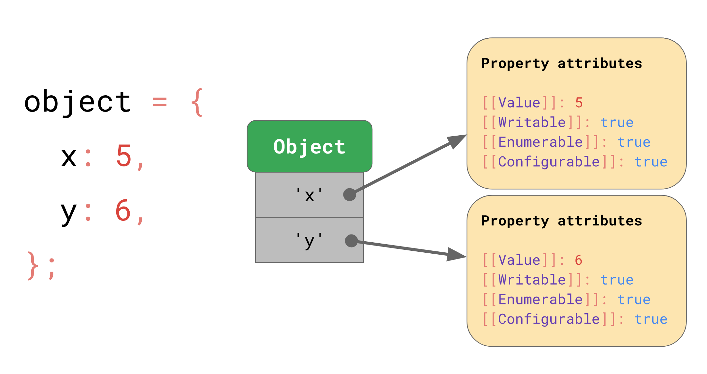
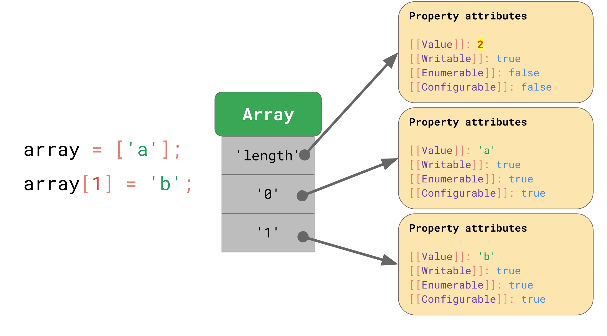

# Shapes&Inline Caches

## 参考
  - https://github.com/dt-fe/weekly/blob/master/62.%E7%B2%BE%E8%AF%BB%E3%80%8AJS%20%E5%BC%95%E6%93%8E%E5%9F%BA%E7%A1%80%E4%B9%8B%20Shapes%20and%20Inline%20Caches%E3%80%8B.md
  - 
  - 

## 核心
  - js解析过程
    - 源码 -> parser（分析器）-> AST -> interpreter（解释器）-> bytecode（字节码）
    -> optimizing compiler（优化编辑器） -> optimized code（优化后的机器码）
  - Shapes
    - 
    - 创建对象后，属性值会存储到JSObject中，如果多个对象有相同结构，则可以共享Shape，
    Shape会记录字段，然后找到并缓存对应的下标offset，下次在访问就可以省去找寻步骤
    - ```js
      const a = {};
      a.x = 1; // Shape(x)会从Shape(empty)继承

      const b = { x: 1 }; // 由于b不是从空对象起，故Shape(x)不会存在继承
      ```
  - js创建对象
    - const a = {};
    - const b = new Object();
    - const c = new f1();
    - const d = Object.create(null);