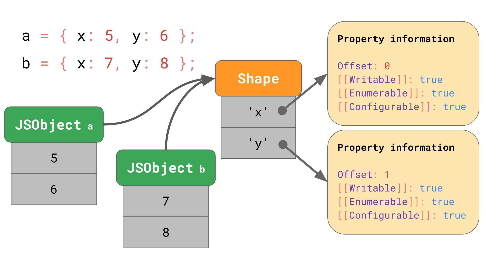

# Shapes&Inline Caches

## 参考
  - https://github.com/dt-fe/weekly/blob/master/62.%E7%B2%BE%E8%AF%BB%E3%80%8AJS%20%E5%BC%95%E6%93%8E%E5%9F%BA%E7%A1%80%E4%B9%8B%20Shapes%20and%20Inline%20Caches%E3%80%8B.md
  - https://juejin.im/entry/5b7e108851882542c20f2018?utm_source=gold_browser_extension
  - 
  - 

## 核心
  - js解析过程
    - 源码 -> parser（分析器）-> AST -> interpreter（解释器）-> bytecode（字节码）
    -> optimizing compiler（优化编辑器） -> optimized code（优化后的机器码）
  - Shapes
    - 
    - 创建对象后，属性值会存储到JSObject中，如果多个对象有相同结构，则可以共享Shape，
    Shape会记录字段，然后找到并缓存对应的下标offset，下次在访问就可以省去找寻步骤
    - ```js
      const a = {};
      a.x = 1; // Shape(x)会从Shape(empty)继承

      const b = { x: 1 }; // 由于b不是从空对象起，故Shape(x)不会存在继承
      ```
    - 数组使用Object.defineProperty([], "0" , {...})监听后，会转成Dictionary Elements结构，比较浪费空间
    用Proxy监听则不会有这问题
  - js创建对象
    - const a = {};
    - const b = new Object();
    - const c = new f1();
    - const d = Object.create(null);
  - 从引擎优化角度而言，`const a = {}`能共享Shape
  - redux推荐用Object.assign
    - ```js
      let c = Object.assign({}, {x:1, y:2, z:3});
      let d = Object.assign({}, c);
      console.log("c and d have same map:", %HaveSameMap(c, d)); // true
      ```

## 总结
  - 尽量以相同方式初始化对象，这样会生成较少的 Shapes
  - 不要混淆对象的propertyKey与数组的下标


