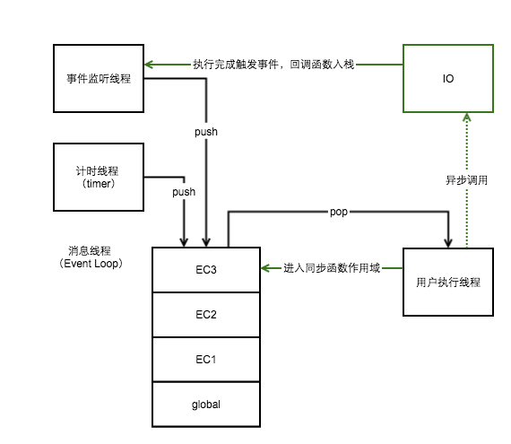

#参考
  - https://www.jianshu.com/p/0983e69d58ec
  - https://zhuanlan.zhihu.com/p/30744300
  - https://juejin.im/entry/59082301a22b9d0065f1a186
  - 

- - -

# Event Loop、Call Stack、Web APIs
  - Event Loop - 事件循环
  - Call Stack - 调用栈
  - Web APIs - 宿主环境

- - -

#Call Stack
* 函数被调用
* 创建执行上下文
    * a) 创建作用域链
    * b) 创建变量、函数和参数
    * c) 求this值
* 开始执行在执行上下文上 执行
    * ...
    * a) 遇到同步函数
    * b) 当前执行上下文入栈
    * c) 重复以上过程
    * ...
* 执行完成，往上一层 执行上下文  返回数据
* 从执行上下文栈pop出一个新的执行上下文执行

- - -

#Event Loop（异步）

* 每个线程都有自己的event loop
* 浏览器可以有多个event loop，browsing contexts和web workers就是相互独立的
* 简略循环过程（script -> 清空微任务 -> 宏任务 -> 清空微任务 -> render -> 宏任务 -> 清空微任务 -> render ->...）
* 完整循环过程
  1. 从macrotask队列选择一个最老的task，如果没有，则执行microtask
  2. 将上面这个task设置为【正在运行的task】
  3. Run: 运行被选择的task
  4. 将【正在运行的task】置为null
  5. 从macrotask队列里移除前边运行的task
  6. 执行microtasks任务检查点
    1. 将microtask checkpoint的flag设为true。
    2. Microtask queue handling: 如果event loop的microtask队列为空，直接跳到第八步（Done）。
    3. 在microtask队列中选择最老的一个任务。
    4. 将上一步选择的任务设为event loop的currently running task。
    5. 运行选择的任务。
    6. 将event loop的currently running task变为null。
    7. 将前面运行的microtask从microtask队列中删除，然后返回到第二步（Microtask queue handling）。
    8. Done: 每一个environment settings object它们的 responsible event loop就是当前的event loop，会给environment settings object发一个 rejected promises 的通知。
    9. 清理IndexedDB的事务。
    10. 将microtask checkpoint的flag设为flase
  7. 更新渲染（Update the rendering）
  8. 如果这是一个worker event loop，但是没有任务在task队列中，并且WorkerGlobalScope对象的closing标识为true，
  则销毁event loop，中止这些步骤，然后进行 run a worker
  9. 返回第一步

* macrotask(宏任务) `task`，包含：
    * 整体代码script
    * setTimeout（标准4ms），setInterval，setImmediate（node）
    * I/O
    * UI交互事件
    * postMessage
* microtask(微任务) `job`，包含：
    * Promise
    * process.nextTick（node）
    * MutaionObserver

- - -

#Web APIs
前端：浏览器、node环境
