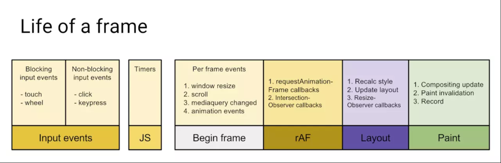
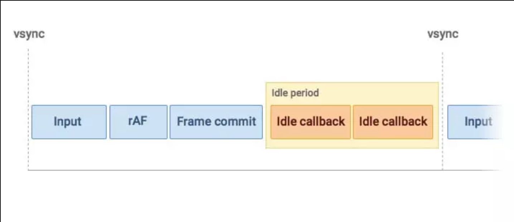

## 参考
1. https://mp.weixin.qq.com/s/LIfvU8j0gBVIFF8AYYtfFg
2. 
3. 

## 帧-生命周期
1. 输入事件（touch、wheel、click、keypress）
2. js脚本
3. 帧事件（window.resize、scroll、media query、animation）
4. rAF（requestAnimationFrame、ObserverCallback、帧回调）
5. layout（重排，计算大小）
6. paint（重绘，更新样式）

## microTask
```js
  function flush() {
    // ...
  };

  function useMutationObserver() {
    var iterations = 0;
    var observer = new MutationObserver(flush);
    var node = document.createTextNode('');
    observer.observe(node, { characterData: true });

    return function () {
      node.data = iterations = ++iterations % 2;
    };
  };
```