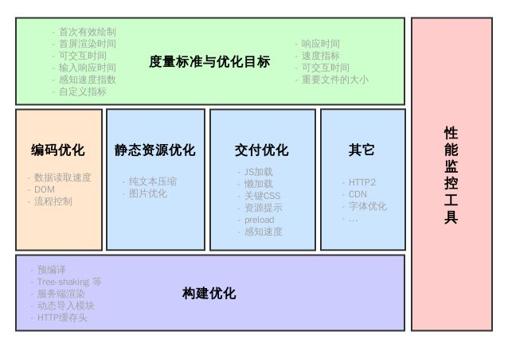

# 性能优化

## 参考
  - 
  - https://juejin.im/post/5b0b7d74518825158e173a0c
  - https://csstriggers.com/
  - web性能优化：https://mp.weixin.qq.com/s?__biz=MzA5NzkwNDk3MQ==&mid=2650587679&idx=1&sn=9698007b09525696896d4cbf135d1ede&scene=21#wechat_redirect

## 职能
  - 布局分层 =》cpu
  - 绘制渲染层 =》gpu

## 思路
  - 提取需要大量重绘、重排的元素，单独分层

## 硬件加速
  - Video元素、WebGL、Canvas、CSS3 3D、CSS滤镜、z-index

## 优化策略
  - css读写分离：js不直接操作样式 =》toggleclass或style.cssText
  - dom离线更新：display：none或visibility:hidden
  - 图片指定宽高
