| 周一        | 周二    |  周三  |  周四  |  周五  |  周六  |  周日  |
| --------   | -----:   | :----: | :----: | :----: | :----: | :----: |
| 背        | 胸     |   肩    |   二头肌    |   腰    |   三头肌    |   腿    |
| 俯身哑铃划船(10 * 4) 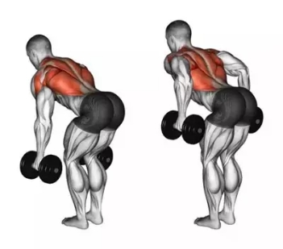         |   上斜俯卧撑(20 * 2) 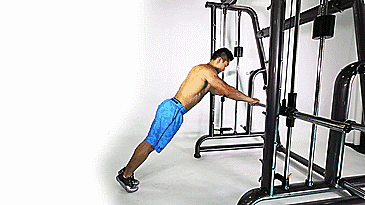   |   奥特曼光波 + 平肩翻转 + 伸臂前/后摇(10 * 2)    |   杠铃(下半+上半+全)弯举(10 * 4)    |   老师好(10 * 6)    |   坐姿颈后哑铃臂屈伸(10 * 4) 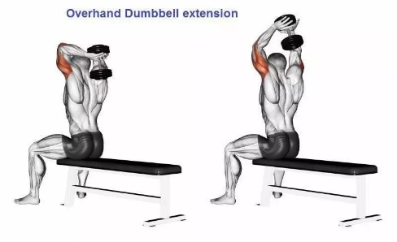   |   自重深蹲(30 * 2)    |
| 俯身杠铃划船(10 * 4) 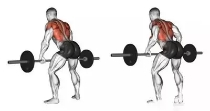        | 上斜杠铃卧推(10 * 4) 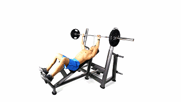     |   站姿杠铃颈前推举(10 * 4)    |   仰卧哑铃交替弯举(10 * 4) 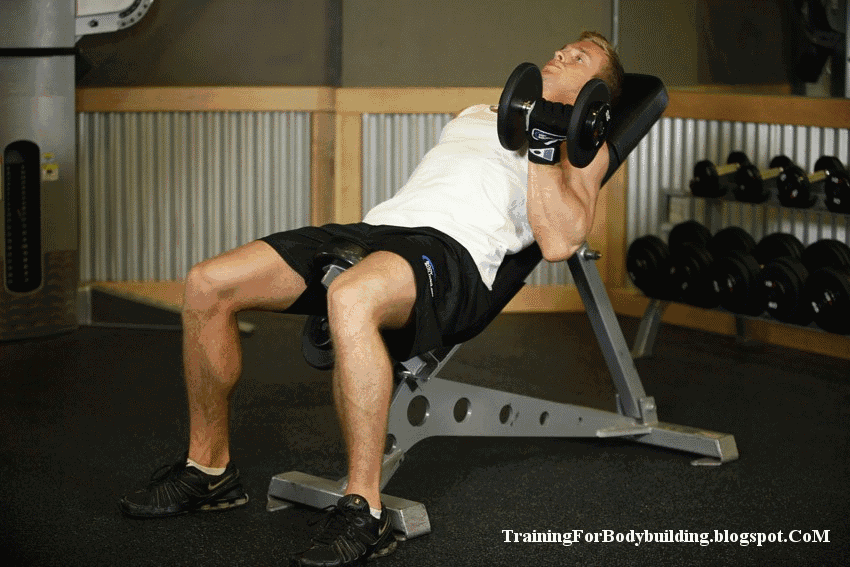    |   杠铃半硬拉(10 * 4) 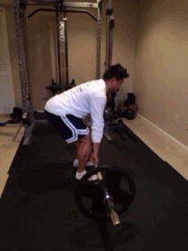    |   板凳撑(10 * 4) 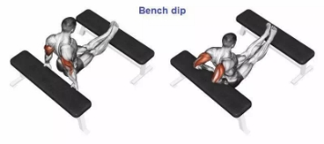    |   哑铃深蹲30 * 2)    |
| 单臂哑铃划船(10 * 4) 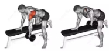        | 平板哑铃飞鸟(10 * 4) 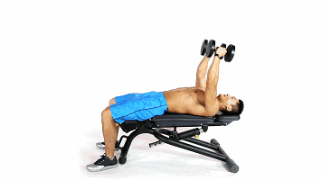     |   坐姿杠铃颈前推举(10 * 4) 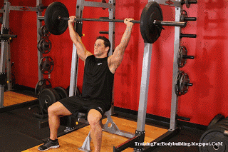    |   哑铃集中弯举(10 * 4) 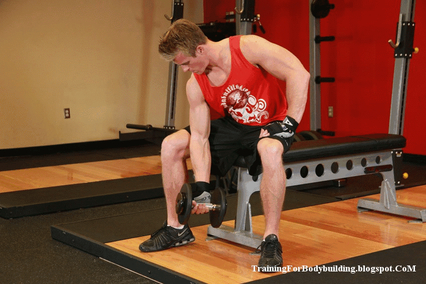    |   杠铃硬拉(10 * 4)     |   斜板额前弯举(10 * 4) 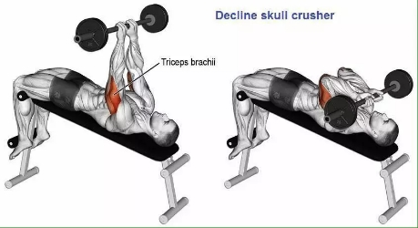    |   哑铃箭步蹲(30 * 2) 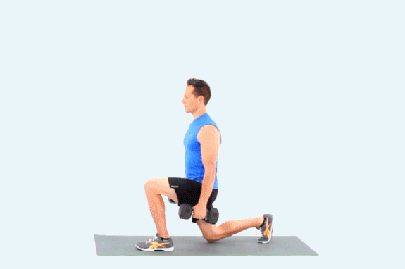    |
| 杠铃硬拉(10 * 4)          | 哑铃平板卧推(10 * 4) 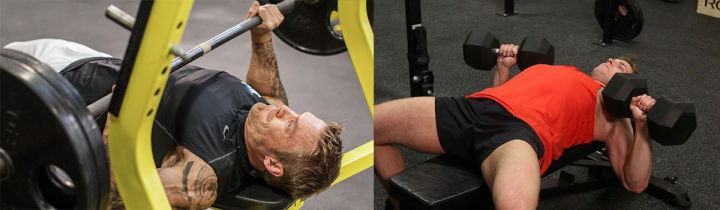     |   坐姿哑铃旋转推举(10 * 4) 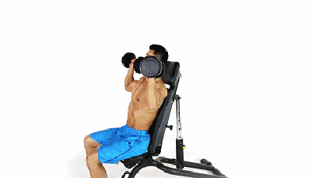    |   站姿锤式哑铃弯举(10 * 4) 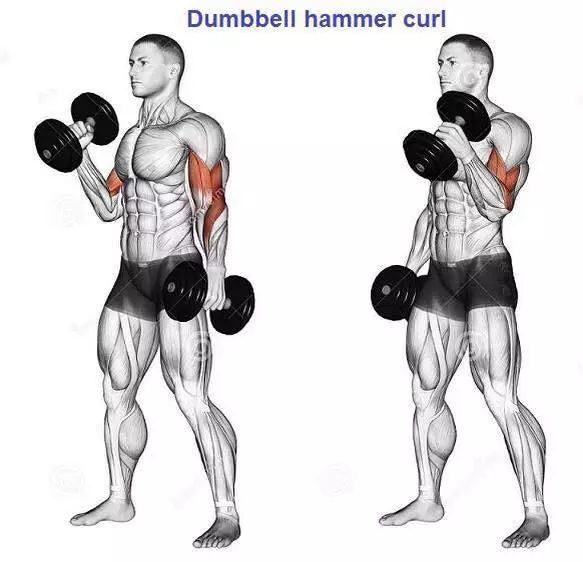    |   山羊挺身(10 * 4)    |   俯身哑铃臂屈伸(10 * 4) 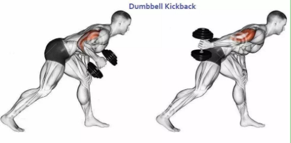    |   杠铃箭步蹲(30 * 2) 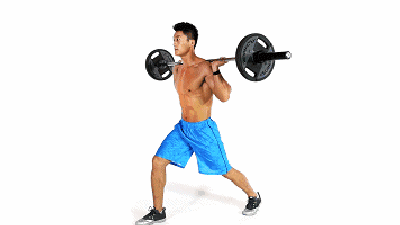    |
| 哑铃硬拉(10 * 4) 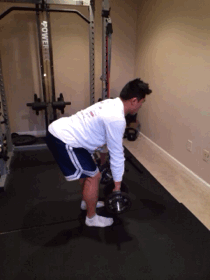        | 哑铃上斜卧推(10 * 4) 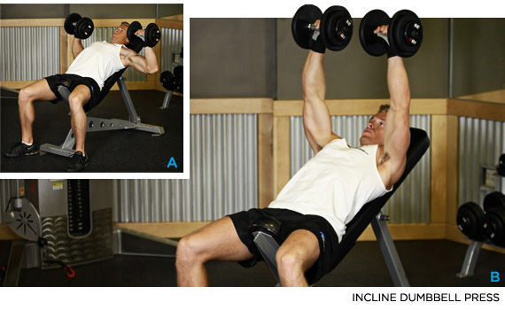     |   哑铃前平举(10 * 4) 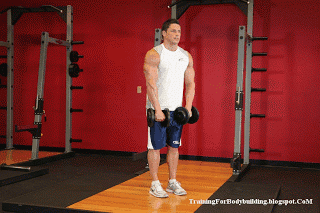    |   牧师凳哑铃弯举(10 * 4) 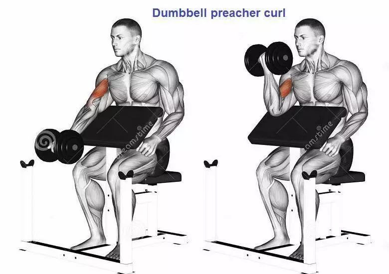    |   TODO    |   躺姿额头哑铃臂屈伸(10 * 4) 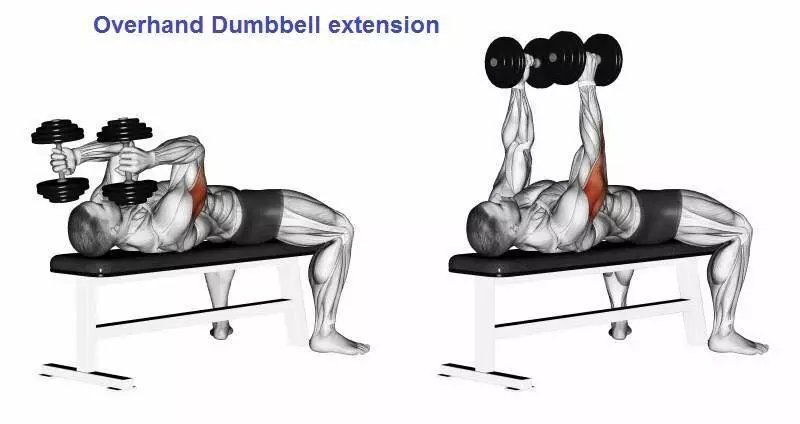    |   TODO    |
| 俯身双臂划船(10 * 4) 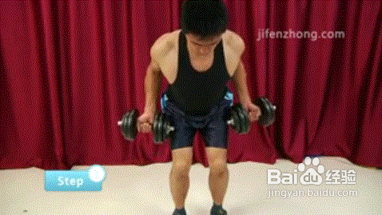        | 胸肌臂屈伸(10 * 4) 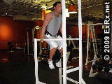     |   哑铃侧平举(10 * 4) 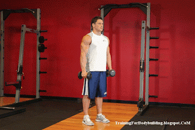    |   俯身上斜哑铃臂屈伸(10 * 4)    |   TODO    |   站姿颈后哑铃臂屈伸(10 * 4) 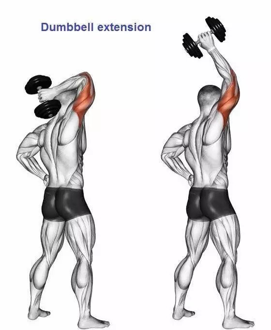    |   TODO    |
| TODO        | 夹胸(20 * 4)    |   哑铃俯身飞鸟 + 前平举(10 * 4) 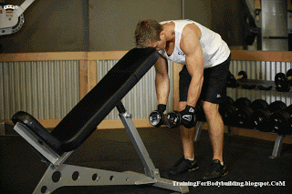    |   TODO    |   TODO    |   TODO    |   TODO    |
