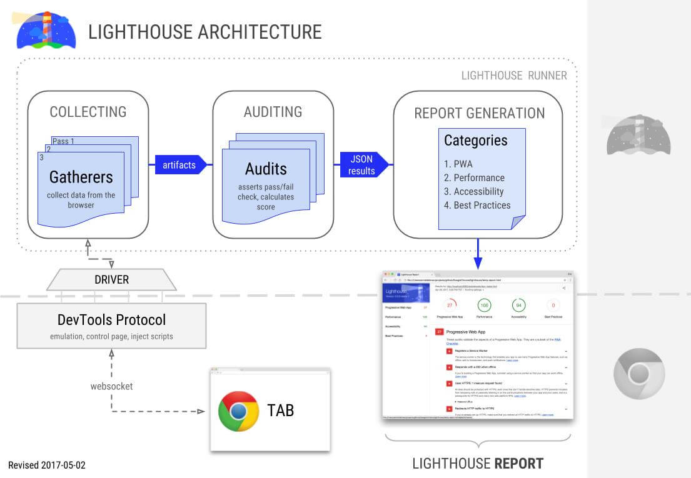
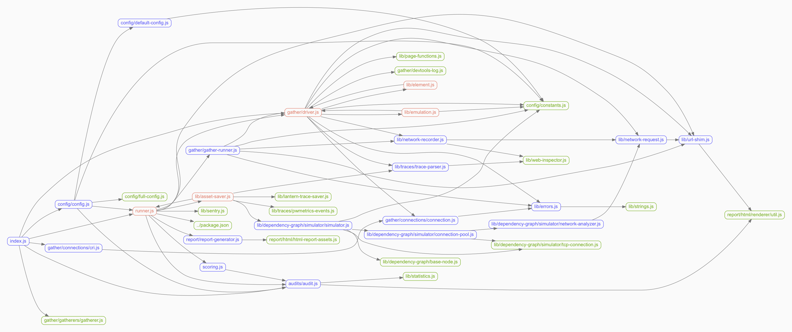

# lighthouse

[TOC]

## 参考
- [lighthouse指南](https://juejin.im/post/5dca05f45188250c643b7d76#heading-23)
- [lighthouse-with-puppeteer](https://medium.com/@jovd/lighthouse-with-puppeteer-5dc4e3245eed)
- [tesseract.js训练模型](https://github.com/naptha/tessdata)
- [puppeteer疑难杂症](https://github.com/puppeteer/puppeteer/blob/master/docs/troubleshooting.md#chrome-headless-doesnt-launch)
- [屏幕录制rrweb](https://mp.weixin.qq.com/s/5RUjvKOBjqX5Btrse-C3Jg)

---

## 介绍



### 基本流程

> 可以分为：采集 -> 消费 -> 输出报告

**采集-Gatherers**

lighthouse默认会提供很多`gatherers`采集需要的数据，但是还有部分没有采集（比如手动调用的console.log）。

我们可以自定义类似的`gatherers`

```js
class ConsoleLogs extends Gatherer {

  private logs: CM.LogItem[] = [];

  private onRuntimeConsoleAPICalledThis: (...args: any[]) => void;

  constructor() {
    super();
    this.onRuntimeConsoleAPICalledThis = this.onRuntimeConsoleAPICalled.bind(this);
  }

  public onRuntimeConsoleAPICalled(entry: CM.LogItem) {
    const { type, args = [] } = entry;
    if (
      type === 'log'
      && args.length >= 2
      && logKeys.includes(args[0].value)
    ) {
      this.logs.push(entry);
    }
  }

  public beforePass(passContext: LH.Gatherer.PassContext) {
    const { driver } = passContext;
    // 初始化，监听console调用
    driver.on('Runtime.consoleAPICalled', this.onRuntimeConsoleAPICalledThis);
  }

  public async afterPass(
    passContext: LH.Gatherer.PassContext,
  ) {
    const { driver } = passContext;
    // 卸载时，移除console监听
    await driver.off('Runtime.consoleAPICalled', this.onRuntimeConsoleAPICalledThis);
    return this.logs;
  }
}

export = ConsoleLogs;
```

**消费-Audits**

`audits`即审计项，用于消费`gatherers`里采集的原始信息，这块我们也可以自定义

```js
class MyAudit extends Audit {
  static get meta() {
    return {
      description: '描述',
      id: 'audit-id',
      requiredArtifacts: [
        '依赖的gatherers',
      ],
      title: '标题',
    };
  }

  public static audit(artifacts: LH.Artifacts & CM.CustomArtifact) {
    // 一些处理...
    return {
      details: Audit.makeTableDetails(MyAudit.getHeadings(), data), // '审计项内容，一般为表格输出'
      displayValue: '审计项标题',
      score: 1, // 得分，0-1
    };
  }

  private static getHeadings() {
    return [
      {
        itemType: 'text',
        key: 'mykey',
        text: '名称',
      },
      // ...
    ];
  }
}

export = MyAudit;
```

### 报告分类

- 性能
- 渐进式
- seo
- 最佳实践
- 无障碍


---

## lighthouse封装

- [参考](../node/lighthouse/README.md)
- [自定义lighthouse统计指标](https://github.com/GoogleChrome/lighthouse/blob/master/docs/recipes/lighthouse-plugin-example/readme.md)

### 配置说明

**throttlingMethod**

[参考](https://stackoverflow.com/questions/49899765/how-to-disable-throttling-in-lighthouse-programmaticaly/55850374#55850374)
> 节流方式，有 provided、devtools、simulate，provided表示不节流

```js
{
  "settings": {
    throttlingMethod: 'provided', // 直接使用当前网络环境测试
    throttling: {
      throughputKbps: 8000,
      downloadThroughputKbps: 8000,
      uploadThroughputKbps: 2000,
    },
  },
}
```

含义看代码
```js
// node_modules/lighthouse/lighthouse-core/computed/load-simulator.js

switch (throttlingMethod) {
  case 'provided':
    options.rtt = networkAnalysis.rtt;
    options.throughput = networkAnalysis.throughput;
    options.cpuSlowdownMultiplier = 1;
    options.layoutTaskMultiplier = 1;
    break;
  case 'devtools':
    if (throttling) {
      options.rtt =
        throttling.requestLatencyMs / constants.throttling.DEVTOOLS_RTT_ADJUSTMENT_FACTOR;
      options.throughput =
        throttling.downloadThroughputKbps * 1024 /
        constants.throttling.DEVTOOLS_THROUGHPUT_ADJUSTMENT_FACTOR;
    }

    options.cpuSlowdownMultiplier = 1;
    options.layoutTaskMultiplier = 1;
    break;
  case 'simulate':
    if (throttling) {
      options.rtt = throttling.rttMs;
      options.throughput = throttling.throughputKbps * 1024;
      options.cpuSlowdownMultiplier = throttling.cpuSlowdownMultiplier;
    }
    break;
  default:
    // intentionally fallback to simulator defaults
    break;
}
```

---

## puppeteer
[踩坑指南](https://juejin.im/post/5b99c9ece51d450e51625630)

不装chromium指令

```
env PUPPETEER_SKIP_CHROMIUM_DOWNLOAD=true npm i puppeteer -D

// 或

npm install puppeteer --ignore-scripts
```

### 检查代码覆盖率
```js
const puppeteer = require('puppeteer');

async function checkCoverage(url) {
  const pathToExtension = '/usr/bin/google-chrome-stable';
  const browser = await puppeteer.launch({
    args: [
      '--no-sandbox',
      '--headless',
      '--disable-gpu',
      '--show-paint-rects',
    ],
    // 服务器上不装 chromium，或装失败的话，需要用 executablePath 手动指定机器上的 google-chrome-stable（一般是上面这个地址），其他情况不用
    executablePath: pathToExtension,
  });
  const page = await browser.newPage();
  await Promise.all([
    page.coverage.startJSCoverage(),
    page.coverage.startCSSCoverage(),
  ]);
  await page.goto(url);
  const [jsCoverage, cssCoverage] = await Promise.all([
    page.coverage.stopJSCoverage(),
    page.coverage.stopCSSCoverage(),
  ]);

  await page.close();
  await browser.close();
  console.log(jsCoverage, cssCoverage);
}
```

### 基于puppeteer的自动化测试
[参考](../node/puppeteer/test-case/README.md)


## lighthouse-plugin
[chrome协议总览](https://vanilla.aslushnikov.com/)
[自定义gatherer-参考](https://www.aymen-loukil.com/en/blog-en/google-lighthouse-custom-audits/)
[自定义gatherer-代码](https://github.com/AymenLoukil/Google-lighthouse-custom-audit)

### 关键代码

**文件总览**

https://paulirish.github.io/lighthouse/docs/api/lighthouse/2.5.1/index.html

**config入口**



```
node_modules/lighthouse/lighthouse-core/config/config.js#L.301
```

**artifacts**

```
node_modules/lighthouse/lighthouse-core/runner.js#L.82
```

**gatherer**

```
node_modules/lighthouse/lighthouse-core/config/config.js#L.343
```

- defaultPass
- offlinePass
- redirectPass

### 一个npm包可以包含多个plugin

```js
initLighthouseConfig: (config: ICO) => ({
  ...config,
  plugins: [
    "lighthouse-plugin-aa/src/plugins/container.js",
    "lighthouse-plugin-aa/src/plugins/performance.js",
  ],
  passes: [{
    passName: 'defaultPass',
    gatherers: [
      'lighthouse-plugin-aa/src/gatherers/custom-log-gatherer',
    ],
  }],
  settings: {
    ...config.settings,
    onlyCategories: [
      "lighthouse-plugin-aa/src/plugins/container.js",
      "lighthouse-plugin-aa/src/plugins/performance.js",
    ],
  },
}),
```


---


## rrweb

[屏幕录制rrweb](https://mp.weixin.qq.com/s/5RUjvKOBjqX5Btrse-C3Jg)

> 监听dom变更，模拟屏幕录制。
>
> 核心包：
>
> - rrweb
> - rrweb-snapshot
> - rrweb-player

```js
import rrweb from 'rrweb';

let events = [];

let stopFn = rrweb.record({
  emit(event) {
    events.push(event); // 将 event 存入 events 数组中
    if (events.length > 100) { // 当事件数量大于 100 时停止录制
      stopFn();
    }
  },
});

// rrweb 播放器回放
const replayer = new rrweb.Replayer(events);
replayer.play(); // 播放
```

