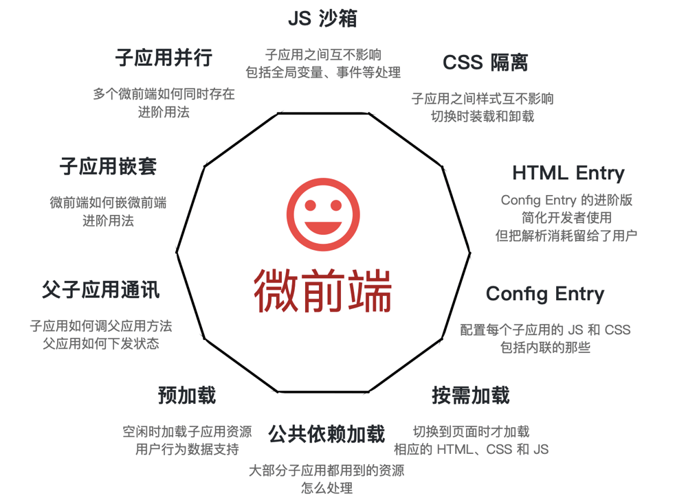

# 微前端

[TOC]

## 参考
- [大前端时代下的微前端架构](https://mp.weixin.qq.com/s/DVkrV_KKE9KaGSeUSenc6w)
- [微前端框架-qiankun](https://zhuanlan.zhihu.com/p/131022025)
- [微前端的css使用方案](https://mp.weixin.qq.com/s/qUiiUkKOyW-QnBz1WEOTwQ)
- [qiankun实践案例1](https://mp.weixin.qq.com/s?__biz=Mzg2MDY5MTMxOA==&mid=2247485967&idx=1&sn=c5060dc6c4b48e89b307b59cabebebcd&chksm=ce23c416f9544d0018da5c60462efdff6dc95421f85001b78c18ba7adbaf244addf1f02fa9a1&token=82437422&lang=zh_CN#rd)



## 方案对比

|              | **特点** | **优点**                                                     | **缺点**                                                     | **背景&设计思路**                                            |
| ------------ | -------- | ------------------------------------------------------------ | ------------------------------------------------------------ | ------------------------------------------------------------ |
| qiankun      | 重配置   | 适合大型前端项目市场认可度高适配大多主流框架或VanillaJS      | 需要额外的强约束的配置代码不支持vite和路由强绑定             | 基座的接入方多&未知，只有通过强规范约束才能保证功能一致性    |
| 轻量级微前端 | 重灵活   | 适合小型前端项目基于构建工具的适配（webpack、rollup）可定制化程度高打通内部cdn | 一些通用问题还没解决（css冲突、沙盒环境、独立通用组件等）目前仅用于vue3项目 | 接入方非常明确，主旨是不改变ab前端的开发习惯，无额外理解成本的前提下，方便扩展 |

## 原理

- **webpack**
    - 前端本质是render给定的html到一个dom，微前端只是希望dom由调用方控制
    - Webpack会根据配置中的entry属性，生成与之对应的入口文件（js），页面加载这个入口文件时，也会自动去加载其所有依赖，依赖再加载依赖的依赖

- **vite**
    - 思路和webpack一致，只是hook不同

流程：
- compilation钩子，获取 **installedModules** 私有变量，放到全局
- 通过publicPath（vite里是base属性），改变依赖引用的文件地址前缀
- window.webpackJsonp

---

## 原则
- 单一目的
- 松耦合
- 高聚性

## 几个问题

[参考](https://zhuanlan.zhihu.com/p/82051427)

- 登录验证
- 全局异常
- 公共类库（相同/不同框架、相同/不同版本框架）
- 动态加载（必要性考究）
- 项目耦合
- 组件抽象（必要性考究）
- 编排层
  * 路由管理
  * 生命周期
  * 加载/卸载

## 常见模式

- iframe集成
- 运行时集成
- web-component集成

### iframe集成
```html
<html>
  <head>
    <title>Feed me!</title>
  </head>
  <body>
    <h1>Welcome to Feed me!</h1>

    <iframe id="micro-frontend-container"></iframe>

    <script type="text/javascript">
      const microFrontendsByRoute = {
        '/': 'https://browse.example.com/index.html',
        '/order-food': 'https://order.example.com/index.html',
        '/user-profile': 'https://profile.example.com/index.html',
      };

      const iframe = document.getElementById('micro-frontend-container');
      iframe.src = microFrontendsByRoute[window.location.pathname];
    </script>
  </body>
</html>
```

### 运行时集成
```html
<html>
  <head>
    <title>Feed me!</title>
  </head>
  <body>
    <h1>Welcome to Feed me!</h1>

    <!-- These scripts don't render anything immediately -->
    <!-- Instead they attach entry-point functions to `window` -->
    <script src="https://browse.example.com/bundle.js"></script>
    <script src="https://order.example.com/bundle.js"></script>
    <script src="https://profile.example.com/bundle.js"></script>

    <div id="micro-frontend-root"></div>

    <script type="text/javascript">
      // These global functions are attached to window by the above scripts
      const microFrontendsByRoute = {
        '/': window.renderBrowseRestaurants,
        '/order-food': window.renderOrderFood,
        '/user-profile': window.renderUserProfile,
      };
      const renderFunction = microFrontendsByRoute[window.location.pathname];

      // Having determined the entry-point function, we now call it,
      // giving it the ID of the element where it should render itself
      renderFunction('micro-frontend-root');
    </script>
  </body>
</html>
```

### web-component集成
```html
<html>
  <head>
    <title>Feed me!</title>
  </head>
  <body>
    <h1>Welcome to Feed me!</h1>

    <!-- These scripts don't render anything immediately -->
    <!-- Instead they each define a custom element type -->
    <script src="https://browse.example.com/bundle.js"></script>
    <script src="https://order.example.com/bundle.js"></script>
    <script src="https://profile.example.com/bundle.js"></script>

    <div id="micro-frontend-root"></div>

    <script type="text/javascript">
      // These element types are defined by the above scripts
      const webComponentsByRoute = {
        '/': 'micro-frontend-browse-restaurants',
        '/order-food': 'micro-frontend-order-food',
        '/user-profile': 'micro-frontend-user-profile',
      };
      const webComponentType = webComponentsByRoute[window.location.pathname];

      // Having determined the right web component custom element type,
      // we now create an instance of it and attach it to the document
      const root = document.getElementById('micro-frontend-root');
      const webComponent = document.createElement(webComponentType);
      root.appendChild(webComponent);
    </script>
  </body>
</html>
```

