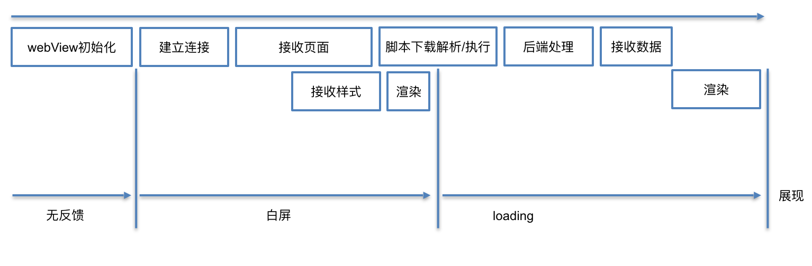
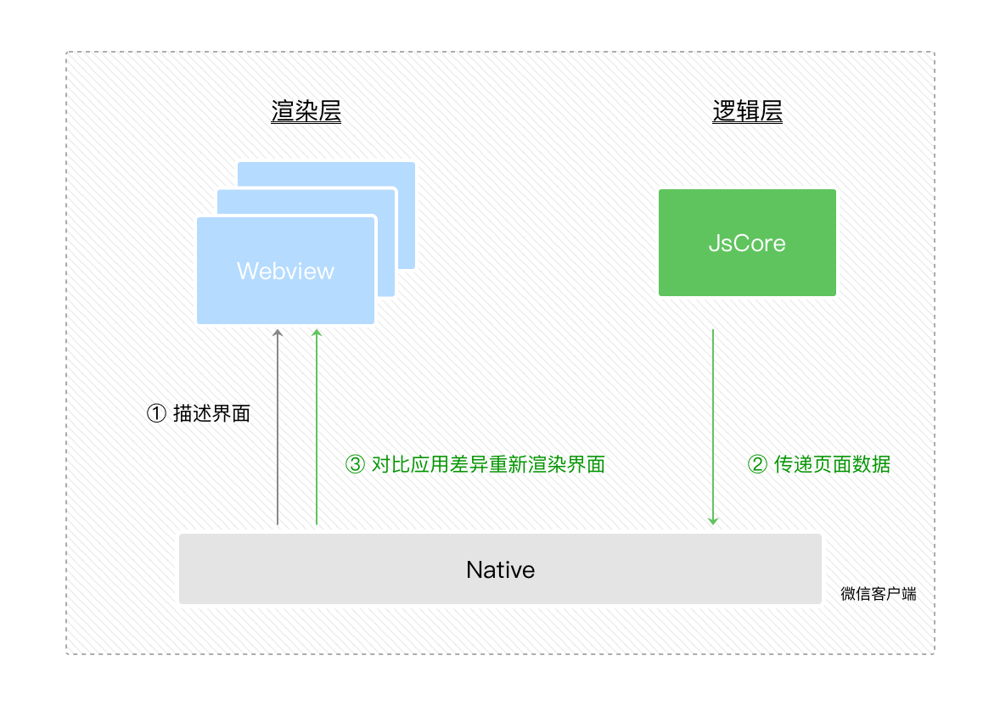

# 微信小程序

## 参考
- [小程序底层框架](https://www.kancloud.cn/tatahy/weixin/710883)
- [原理](https://www.cnblogs.com/freeliver54/p/9024999.html)

## 目录
<details>
<summary>展开更多</summary>

* [`历史`](#历史)
* [`各技术栈比较`](#各技术栈比较)
* [`打包工具`](#打包工具)
* [`实现原理`](#实现原理)
* [`api相关`](#api相关)

</details>

## 历史

### webview&jssdk
以前的webview启动过程，大概分为如下几个阶段（见下图）



很明显存在几个问题：
- webview初始化时无任何反馈
- 页面在建立连接、首次渲染完成前都是白屏
- 首次渲染完成，由于接口数据未返回，展示不完整的页面结构或loading

#### 可行的优化
- spa
- 资源文件缓存

### 小程序
webview+原生组件

- 使用webview开发，门槛低，云端发布
- 框架提供原生组件、api等能力，提升用户体验
- 双线程（渲染层和逻辑层）模式，减少页面卡顿
- 逻辑层无法访问dom和bom，提升安全性

### weex&RN
原生组件

---

## 各技术栈比较
|  | native | h5 | 小程序 |
| -------- | -----: | :----: | :----: |
| 开发门槛 | 高 | 低 | 低 |
| 用户体验 | 好 | 白屏、反馈差 | 接近native |
| 版本更新 | 审核、迭代慢 | 实时在线更新 | 实时在线更新 |
| 管控性 | 平台管控 | 难管 | 可管控 |

---

## 打包工具
- [参考](./build.js)

---

## 微信小程序解析流程
- setData L.26067
- doUpdates L.24544
- diff L.29743
- applyDomOperation L.29862
- flushSendingData L.28318
- vdSyncBatch L.23839
- render

---

## 实现原理
- 双线程模式，防止页面卡顿
- 每个小程序至少占用两个webview：`appView` 和 `appService`
- 每开一个小程序页面，就多一个webview线程，所以有有页面层级5层的限制

### 双线程通信


- 渲染层
- 逻辑层

### appService
- 负责逻辑处理
- 底层由WAService.js提供各种api接口（调试模式是asdebug.js）
  * 日志组件reporter
  * wx原生api
  * App、Page、Component等全局方法
  * amd模块实现
- 消息通信封装为weixinJSBridge

### appView
- 负责视图渲染
- 底层由WAWebview.js提供各种api接口
  * 日志组件
  * wx原生api（和处理ui显示相关的）
  * 组件实现
  * 虚拟节点diff
  * render UI
  * 事件触发
- 通过$gwx模板方法，将wxml转为虚拟节点，最终在webview渲染（与普通h5的差异）
- 渲染的实现方式类似web-component

### Exparser框架
- 微信小程序的组件组织框架
- 类似web-component中的ShadowDOM

### 更新步骤
- 渲染层将wxml转为虚拟节点
- 逻辑层发生数据变更时，调用宿主提供的setData
- setData底层diff出虚拟节点树的变更
- 将树变更信息传给native，再传到渲染层
- 渲染层将diff应用到原dom树

### 打包上传
- wcc：所有wxml转虚拟节点
- wcsc：所有wxss转为js字符串，通过<style/>append到header

### 下载解析
- webview.loadUrl(`page-frame.html`)【page-frame是本地默认框架】
- 下载wxml（虚拟节点）和wxss（style），append到页面
- 根据虚拟节点生成对应的shadowDom或原生组件【利用j-component】
- 动态注入js，和页面进行交互

### 原生组件的使用
- 通过WeixinJsbridge，在html上绑定native调用方法
- html将需要替换的h5元素的位置信息传给native方法
- html对替换元素进行占位处理
- native绘制一个包含原生组件的view层级，盖在webview层级上

**注：map等组件都是原生组件，所以会普通h5组件出现无法覆盖的现象**

解决办法：使用cover-view等原生组件覆盖

---

## api相关

### 获取code
```js
wx.login({
  success(res) {
    /**
     * 返回值
     * {
     *    code: "CODE"
     *    errMsg: "login:ok"
     * }
     */
    console.log(res.code);
  }
});
```

### 获取session_key
```js
request({
  url: 'https://api.weixin.qq.com/sns/jscode2session',
  json: true,
  qs: {
    appid, // 小程序 appId
    secret, // 小程序 appSecret
    js_code: code,  // 登录code
    grant_type: 'authorization_code',
  },
}).then((res) => {
  /**
  * 返回值
  * {
  *   openid: "openid", // 用户唯一标识
  *   session_key: "session_key", // 会话密钥
  *   unionid: "unionid", // 用户在开放平台的唯一标识符，在满足 UnionID 下发条件的情况下会返回
  * }
  */
});
```

### 检查是否需要更新session_key
```js
wx.checkSession({
  success() {
    // session_key 未过期，并且在本生命周期一直有效
  },
  fail() {
    // session_key 已经失效，需要重新执行登录流程
    wx.login() // 重新登录
  }
});
```

### 签名校验
1. getUserInfo点击按钮获取用户信息
```js
// rawData
{
 "nickName": "Band",
 "gender": 1,
 "language": "zh_CN",
 "city": "Guangzhou",
 "province": "Guangdong",
 "country": "CN",
 "avatarUrl": "avatarUrl"
}

// signature
'signature=='
```
2. 服务端依据signature = sha1( rawData + session_key )，加密后对比前后签名是否一致
```js
const crypto = require('crypto');
const session_key = 'session_key';
const shasum = crypto.createHash('sha1');
shasum.update(rawData + session_key);
const realSignature = shasum.digest('hex');
console.log(realSignature === signature); // true签名校验通过
```

### 信息解密
1. getphonenumber点击按钮获取用户信息
```js
{
  encryptedData: "encryptedData=="
  errMsg: "getPhoneNumber:ok"
  iv: "iv=="
}
```

2. 服务端解密
```js
const crypto = require('crypto');
const sessionKey = new Buffer(session_key, 'base64');
const encryptedData = new Buffer(encryptedData, 'base64');
const iv = new Buffer(iv, 'base64');
const decipher = crypto.createDecipheriv('aes-128-cbc', sessionKey, iv);
// 设置自动 padding 为 true，删除填充补位
decipher.setAutoPadding(true);
let decoded = decipher.update(encryptedData, 'binary', 'utf8');
decoded += decipher.final('utf8');
decoded = JSON.parse(decoded);

/**
 * decoded
 *
 * {
 *  "phoneNumber": "phoneNumber",
 *  "purePhoneNumber": "purePhoneNumber",
 *  "countryCode": "86",
 *  "watermark": {
 *    "appid": "APPID",
 *    "timestamp": TIMESTAMP
 *   }
 * }
 */
console.log(decoded);
```


