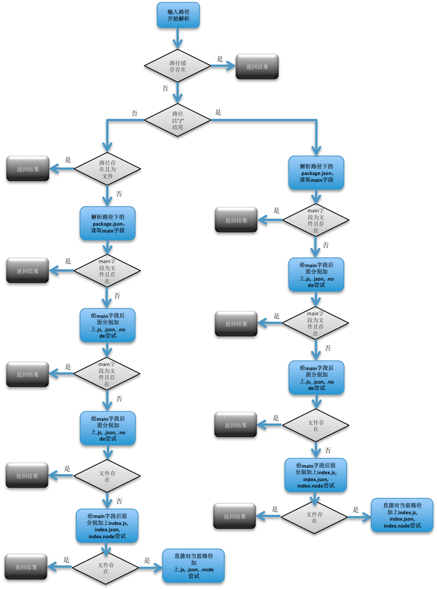

# node

## 参考
  - 源码分析：http://efe.baidu.com/blog/nodejs-module-analyze/

## require原理
  - 
  - 关键
    - 核心 JavaScript 模块源代码是通过 process.binding('natives') 从内存中获取
    - 第三方 JavaScript 模块源代码是通过 fs.readFileSync 方法从文件中读取，根据不同扩展名，做不同读取校验
  - 源代码
    1. 引用
      - ```js
        const http = require('http');
        ```
    2. 原型
      - ```js
        Module.prototype.require = function(path) {
          assert(path, 'missing path');
          assert(typeof path === 'string', 'path must be a string');
          return Module._load(path, this, /* isMain */ false);
        };
        ```
    3. Module._load
      - ```js
        Module._load = function(request, parent, isMain) {
          if (parent) {
            debug('Module._load REQUEST %s parent: %s', request, parent.id);
          }

          var filename = Module._resolveFilename(request, parent, isMain);

          var cachedModule = Module._cache[filename];
          // 有缓存则直接返回
          if (cachedModule) {
            return cachedModule.exports;
          }

          // 判断该模块是否为核心模块，如果则调用核心模块的加载方法NativeModule.require
          if (NativeModule.nonInternalExists(filename)) {
            debug('load native module %s', request);
            return NativeModule.require(filename);
          }

          // 如果不是核心模块，新创建一个 Module 对象
          var module = new Module(filename, parent);

          if (isMain) {
            process.mainModule = module;
            module.id = '.';
          }

          Module._cache[filename] = module;

          tryModuleLoad(module, filename);

          return module.exports;
        };
        ```
      4. Module._resolveFilename
        - ```js
          Module._resolveFilename = function(request, parent, isMain) {
            // ...
            var filename = Module._findPath(request, paths, isMain);
            if (!filename) {
              var err = new Error("Cannot find module '" + request + "'");
              err.code = 'MODULE_NOT_FOUND';
              throw err;
            }
            return filename;
          };
          ```
      5. [Module._findPath](https://github.com/nodejs/node/blob/v6.x/lib/module.js#L158)
      6. NativeModule.require
        - 如果是 built-in 模块 -> process.binding('模块名')
        - 判断 cache 中是否已经加载过，如果有，直接返回 exports
        - 新建 nativeModule 对象，然后缓存，并加载编译
      7. require用户自定义模块
        - tryModuleLoad
      8. Module.prototype.load
        - ```js
          NativeModule.wrap = function(script) {
            return NativeModule.wrapper[0] + script + NativeModule.wrapper[1];
          };

          NativeModule.wrapper = [
            '(function (exports, require, module, __filename, __dirname) { ',
            '\n});'
          ];

          NativeModule.prototype.compile = function() {
            var source = NativeModule.getSource(this.id);
            source = NativeModule.wrap(source);

            this.loading = true;

            try {
              const fn = runInThisContext(source, {
                filename: this.filename,
                lineOffset: 0,
                displayErrors: true
              });
              fn(this.exports, NativeModule.require, this, this.filename);

              this.loaded = true;
            } finally {
              this.loading = false;
            }
          };

          Module.prototype.load = function(filename) {
            debug('load %j for module %j', filename, this.id);

            assert(!this.loaded);
            this.filename = filename;
            this.paths = Module._nodeModulePaths(path.dirname(filename));

            var extension = path.extname(filename) || '.js';

            // 通过不同扩展名，选择不同的处理
            if (!Module._extensions[extension]) extension = '.js';
            Module._extensions[extension](this, filename);
            this.loaded = true;
          };

          // Native extension for .js
          Module._extensions['.js'] = function(module, filename) {
            var content = fs.readFileSync(filename, 'utf8');
            // _compile
            module._compile(internalModule.stripBOM(content), filename);
          };


          // Native extension for .json
          Module._extensions['.json'] = function(module, filename) {
            var content = fs.readFileSync(filename, 'utf8');
            try {
              module.exports = JSON.parse(internalModule.stripBOM(content));
            } catch (err) {
              err.message = filename + ': ' + err.message;
              throw err;
            }
          };


          //Native extension for .node
          Module._extensions['.node'] = function(module, filename) {
            return process.dlopen(module, path._makeLong(filename));
          };

          // ...
          Module.wrap = NativeModule.wrap;
          // ...
          Module.prototype._compile = function(content, filename) {
          // ...

          // create wrapper function
          var wrapper = Module.wrap(content);

          var compiledWrapper = vm.runInThisContext(wrapper, {
            filename: filename,
            lineOffset: 0,
            displayErrors: true
          });

          // ...
          var result = compiledWrapper.apply(this.exports, args);
          if (depth === 0) stat.cache = null;
          return result;
        };
          ```


