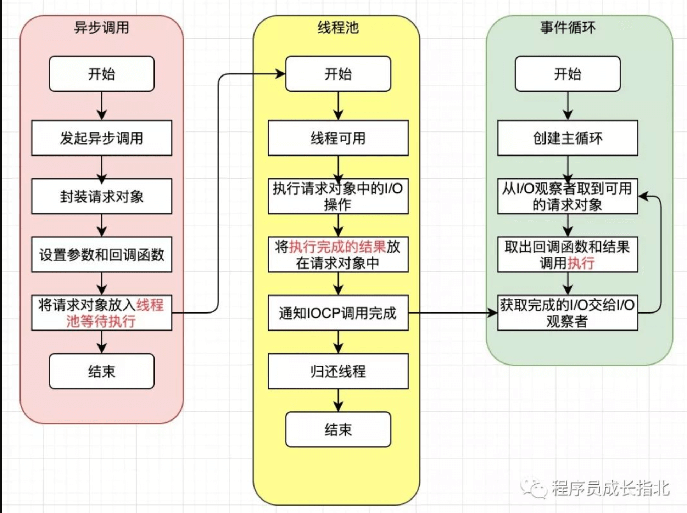

# node

[git](https://github.com/nodejs/node.git)

## 参考
- [源码分析](http://efe.baidu.com/blog/nodejs-module-analyze/)
- [node问题排查](https://zhuanlan.zhihu.com/p/41178823)
- [node性能提升！！](https://zhuanlan.zhihu.com/p/50055740)
- [node实际中的应用](https://juejin.im/post/5ca321f76fb9a05e5d09bb8a?utm_source=gold_browser_extension)
- [NodeJS和命令行程序](https://mp.weixin.qq.com/s/-jxYbmcbdt5IvpJC0BYOjg)
- [浏览器运行node.js](https://blog.stackblitz.com/posts/introducing-webcontainers/)
- [最小化类node运行时-txiki](https://github.com/saghul/txiki.js)
- [crone表达式-在线调试](https://crontab.guru/#)
- [cron表达式-含义解释](https://tool.lu/crontab/)
- [嵌入设备的微型node](https://github.com/yodaos-project/ShadowNode)

## 目录
* [`调试参数`](#调试参数)
* [`好用的库`](#好用的库)
* [`require原理`](#require原理)
* [`eventLoop`](#eventLoop)
* [`GC`](#GC)
* [`shebang`](#shebang)
* [`循环引用`](#循环引用)
* [`最佳实践`](#最佳实践)
* [`异步错误`](#异步错误)
* [`进程线程`](#进程线程)
* [`打印日志`](#打印日志)
* [`手动打包指南`](#手动打包指南)
* [`源码解析`](#库源码解析)
* [`库开发模式`](#库开发模式)
* [`内存泄漏`](#内存泄漏)
* [`其他`](#其他)
* [`公司架构`](#公司架构)
* [`一些尝试`](#一些尝试)
* [`版本日志`](#版本日志)

## 调试参数

**--async-stack-traces**

> 示例：`node --async-stack-traces index.js`
> 异步堆栈跟踪

**--inspect**

> 开启调试

```sh
node --inspect test.js
```

**--inspect-brk**

> 同上，开启 chrome://inspect 调试

```sh
node --inspect-brk dist/app.js
```


---

## 好用的库
- [监听文件夹变化](https://github.com/dt-fe/weekly/blob/master/59.%E7%B2%BE%E8%AF%BB%E3%80%8A%E5%A6%82%E4%BD%95%E5%88%A9%E7%94%A8%20Nodejs%20%E7%9B%91%E5%90%AC%E6%96%87%E4%BB%B6%E5%A4%B9%E3%80%8B.md)

- [调试工具-ndb](https://zhuanlan.zhihu.com/p/45851471)

- [JSON.stringify工具-fast-json-stringify](https://github.com/fastify/fast-json-stringify)
  
  - 预设字段类型，加速stringify
  
- [promise工具-bluebird](https://github.com/petkaantonov/bluebird)
  - V8 原生实现的 Promise 比 bluebird 这样第三方实现的 Promise 库要慢很多
  - 可以在代码中把全局的 Promise 换为 bluebird 的实现，比如
  
- [打包工具-ncc](https://zeit.co/blog/ncc)

- [图片压缩工具-sharp](https://github.com/lovell/sharp?utm_source=75weekly&utm_medium=75weekly)

- [检查库的两个版本间的diff](https://diff.intrinsic.com/)

- [npm源管理工具-nrm/yrm](https://juejin.im/post/5cc81991f265da036d79c8ca?utm_medium=hao.caibaojian.com&utm_source=hao.caibaojian.com)

- [搭建私有npm工具-verdaccio](https://juejin.im/post/5cc81991f265da036d79c8ca?utm_medium=hao.caibaojian.com&utm_source=hao.caibaojian.com)

- [数据校验工具 schema-typed](https://juejin.im/post/5b87c8a5e51d4538e41067a8)

- [图片压缩工具-optimizt](https://github.com/funbox/optimizt)

- [自动生成mock数据-faker.js](https://github.com/Marak/faker.js)

- [页面截屏-dom-to-image](https://www.npmjs.com/package/dom-to-image)

- [页面截图2-html2canvas](https://html2canvas.hertzen.com/configuration)

- [自动生成依赖结构-madge](https://github.com/pahen/madge)

- [图像比对-自动化测试](https://www.npmjs.com/package/jest-image-snapshot)

- [终端滚动菜单-console-menu](https://www.npmjs.com/package/console-menu)

- [自动生成依赖结构-dependency-cruiser](https://github.com/sverweij/dependency-cruiser)
  * ```
    npm install -g verdaccio

    verdaccio
    // warn --- http address - http://localhost:4873/ - verdaccio/3.0.0

    nrm add verdaccio http://localhost:4873

    nrm use verdaccio

    npm adduser

    npm publish
    ```
  
- [DOM转canvas工具-html2canvas、dom-to-image](https://segmentfault.com/a/1190000019035021?utm_medium=hao.caibaojian.com&utm_source=hao.caibaojian.com&share_user=1030000000178452)
  ```js
  global.Promise = require('bluebird');
  ```
  
- [pipeline-stream](https://nodejs.org/dist/latest-v10.x/docs/api/stream.html#stream_stream_pipeline_streams_callback)

- [性能诊断node-clinic](https://github.com/nearform/node-clinic)

- [服务器性能测试-autocannon](https://github.com/mcollina/autocannon)

- [压测autocannon](https://github.com/mcollina/autocannon)

- [jest可视化-majestic](https://github.com/Raathigesh/majestic)

- [在线查看npm包文件-npmview](https://npmview.now.sh/)

- [nvm的后继者？-nvs](https://mp.weixin.qq.com/s/Wnv6AupkNEDlSJz82krbXg)

- [日期格式化-dayjs](https://day.js.org/docs/zh-CN/display/from-now)

- [生成多种uuid-id128](https://github.com/aarondcohen/id128)

- [逻辑编排node-red](https://github.com/node-red/node-red)

- [计划任务node-schedule](https://www.npmjs.com/package/node-schedule)

  - [cron表达式示例](https://segmentfault.com/a/1190000021574315)
  - [cron表达式示例2](https://www.cnblogs.com/linjiqin/p/3178452.html)
  - [Date对象方法](https://developer.mozilla.org/zh-CN/docs/Web/JavaScript/Reference/Global_Objects/Date)
  
- [轻量级提示框popular-message](https://github.com/nihaojob/popular-message)

- [富文本编辑器slate](https://github.com/ianstormtaylor/slate)

- [类型安全的node服务-farrowJs（兼容koa）](https://github.com/farrow-js/farrow)

- [前端数据压缩-**fflate**](https://www.npmjs.com/package/fflate)

- [数据库orm-sequelize](https://www.bookstack.cn/read/sequelize-5.x-zh/spilt.7.transactions.md)

- [前端操作cookie-js-cookie](https://github.com/js-cookie/js-cookie)

- [html和json互转](https://github.com/Jxck/html2json)

- [基于web Animation的动画库](https://motion.dev/)

- [类chalk颜色库-yoctocolors](https://github.com/sindresorhus/yoctocolors)

- [神奇的对象深拷贝-weird-json](https://github.com/i5ik/weird-json)

- [汉字转拼音-pinyin-pro](https://github.com/zh-lx/pinyin-pro)

- [代码逻辑转流程图-code2flow](https://github.com/scottrogowski/code2flow)

- [视频录制-FFmpeg](https://github.com/leandromoreira/ffmpeg-libav-tutorial)

- [实时同步-syncedStore](https://github.com/yousefed/SyncedStore)

- [给图片加滤镜-pixi-color-effects](https://github.com/PixiColorEffects/pixi-color-effects)

- [将网页保存为单个文件-SingleFile](https://chrome.google.com/webstore/detail/singlefile/mpiodijhokgodhhofbcjdecpffjipkle)

- [npm包检测更新-npm-check-updates](https://www.jianshu.com/p/f4b5f22426fd)

- [浏览器原生截图-screenshot](https://github.com/xataio/screenshot)

- [拖拽-dnd](https://www.npmjs.com/package/smooth-dnd)

- [js写shell-zx](https://github.com/google/zx)

- [超声波-quiet.js](https://quiet.github.io/quiet-js/)

- [保持手机不暗屏-nosleep.js](https://github.com/richtr/NoSleep.js)

- [ts版本的lodash-froebel](https://github.com/MathisBullinger/froebel)

- [新手引导-Intro.js/Shepherd/Joyride/Vue-Tour](https://mp.weixin.qq.com/s/loTDmZKR8_hF76xCkB0ehQ)

- [链接加速打开-quicklink](https://github.com/GoogleChromeLabs/quicklink)

- [有限状态机-xstate](https://xstate.js.org/docs/packages/xstate-vue/#quick-start)

### eggjs
[参考](https://segmentfault.com/a/1190000018894188?utm_medium=hao.caibaojian.com&utm_source=hao.caibaojian.com&share_user=1030000000178452)

**进程管理**

+---------+           +---------+          +---------+
|  Master |           |  Agent  |          |  Worker |
+---------+           +----+----+          +----+----+
     |      fork agent     |                    |
     +-------------------->|                    |
     |      agent ready    |                    |
     |<--------------------+                    |
     |                     |     fork worker    |
     +----------------------------------------->|
     |     worker ready    |                    |
     |<-----------------------------------------+
     |      Egg ready      |                    |
     +-------------------->|                    |
     |      Egg ready      |                    |
     +----------------------------------------->|

**进程守护**

+---------+                 +---------+
|  Worker |                 |  Master |
+---------+                 +----+----+
     | uncaughtException         |
     +------------+              |
     |            |              |                   +---------+
     | <----------+              |                   |  Worker |
     |                           |                   +----+----+
     |        disconnect         |   fork a new worker    |
     +-------------------------> + ---------------------> |
     |         wait...           |                        |
     |          exit             |                        |
     +-------------------------> |                        |
     |                           |                        |
    die                          |                        |
                                 |                        |
                                 |                        |

**进程间通信（IPC）**

广播消息： agent => all workers
                  +--------+          +-------+
                  | Master |<---------| Agent |
                  +--------+          +-------+
                 /    |     \
                /     |      \
               /      |       \
              /       |        \
             v        v         v
  +----------+   +----------+   +----------+
  | Worker 1 |   | Worker 2 |   | Worker 3 |
  +----------+   +----------+   +----------+

指定接收方： one worker => another worker
                  +--------+          +-------+
                  | Master |----------| Agent |
                  +--------+          +-------+
                 ^    |
     send to    /     |
    worker 2   /      |
              /       |
             /        v
  +----------+   +----------+   +----------+
  | Worker 1 |   | Worker 2 |   | Worker 3 |
  +----------+   +----------+   +----------+

---

## 原理解析

### require原理

#### 简易步骤
- 路径分析
- 文件定位
- 编译执行

#### 解析顺序


1. 系统缓存
  - 模块被执行之后会会进行缓存
2. 系统模块
  - 原生模块，省略了路径分析、文件定位
3. 文件模块
  - 路径优先级：. -> .. -> /
  - 文件类型优先级：.js -> .json -> .node
4. 目录做为模块
  - main，不存在报错：Error: Cannot find module 
5. node_modules目录加载
  - 从当前目录开始找，直到系统根目录

#### 核心解释
- [How`require()`ActuallyWorks](http://fredkschott.com/post/2014/06/require-and-the-module-system/)
- 关键
  - 核心 JavaScript 模块源代码是通过 process.binding('natives') 从内存中获取
  - 第三方 JavaScript 模块源代码是通过 fs.readFileSync 方法从文件中读取，根据不同扩展名，做不同读取校验
- 源代码
  1. 引用
    - ```js
      const http = require('http');
      ```
  2. 原型
    - ```js
      Module.prototype.require = function(path) {
        assert(path, 'missing path');
        assert(typeof path === 'string', 'path must be a string');
        return Module._load(path, this, /* isMain */ false);
      };
      ```
  3. Module._load
    - ```js
      Module._load = function(request, parent, isMain) {
        if (parent) {
          debug('Module._load REQUEST %s parent: %s', request, parent.id);
        }

        var filename = Module._resolveFilename(request, parent, isMain);

        var cachedModule = Module._cache[filename];
        // 有缓存则直接返回
        if (cachedModule) {
          return cachedModule.exports;
        }

        // 判断该模块是否为核心模块，如果则调用核心模块的加载方法NativeModule.require
        if (NativeModule.nonInternalExists(filename)) {
          debug('load native module %s', request);
          return NativeModule.require(filename);
        }

        // 如果不是核心模块，新创建一个 Module 对象
        var module = new Module(filename, parent);

        if (isMain) {
          process.mainModule = module;
          module.id = '.';
        }

        Module._cache[filename] = module;

        tryModuleLoad(module, filename);

        return module.exports;
      };
      ```
    4. Module._resolveFilename
  
      - ```js
        Module._resolveFilename = function(request, parent, isMain) {
          // ...
          var filename = Module._findPath(request, paths, isMain);
          if (!filename) {
            var err = new Error("Cannot find module '" + request + "'");
            err.code = 'MODULE_NOT_FOUND';
            throw err;
          }
          return filename;
        };
        ```
    5. [Module._findPath](https://github.com/nodejs/node/blob/v6.x/lib/module.js#L158)
    6. NativeModule.require
  
      - 如果是 built-in 模块 -> process.binding('模块名')
      - 判断 cache 中是否已经加载过，如果有，直接返回 exports
      - 新建 nativeModule 对象，然后缓存，并加载编译
    7. require用户自定义模块
  
      - tryModuleLoad
    8. Module.prototype.load
  
    - ```js
        NativeModule.wrap = function(script) {
          return NativeModule.wrapper[0] + script + NativeModule.wrapper[1];
        };
          
      NativeModule.wrapper = [
          '(function (exports, require, module, __filename, __dirname) { ',
          '\n});'
        ];
      
        NativeModule.prototype.compile = function() {
        var source = NativeModule.getSource(this.id);
          source = NativeModule.wrap(source);
      
          this.loading = true;
      
          try {
            const fn = runInThisContext(source, {
              filename: this.filename,
            lineOffset: 0,
              displayErrors: true
            });
            fn(this.exports, NativeModule.require, this, this.filename);
      
            this.loaded = true;
        } finally {
            this.loading = false;
          }
      };
      
        Module.prototype.load = function(filename) {
          debug('load %j for module %j', filename, this.id);
      
          assert(!this.loaded);
        this.filename = filename;
          this.paths = Module._nodeModulePaths(path.dirname(filename));
      
          var extension = path.extname(filename) || '.js';
      
          // 通过不同扩展名，选择不同的处理
        if (!Module._extensions[extension]) extension = '.js';
          Module._extensions[extension](this, filename);
          this.loaded = true;
        };
      
        // Native extension for .js
        Module._extensions['.js'] = function(module, filename) {
          var content = fs.readFileSync(filename, 'utf8');
          // _compile
          module._compile(internalModule.stripBOM(content), filename);
        };
      ```


        // Native extension for .json
        Module._extensions['.json'] = function(module, filename) {
          var content = fs.readFileSync(filename, 'utf8');
          try {
            module.exports = JSON.parse(internalModule.stripBOM(content));
          } catch (err) {
            err.message = filename + ': ' + err.message;
            throw err;
          }
        };


        //Native extension for .node
        Module._extensions['.node'] = function(module, filename) {
          return process.dlopen(module, path._makeLong(filename));
        };
    
        // ...
        Module.wrap = NativeModule.wrap;
        // ...
        Module.prototype._compile = function(content, filename) {
        // ...
    
        // create wrapper function
        var wrapper = Module.wrap(content);
    
        var compiledWrapper = vm.runInThisContext(wrapper, {
          filename: filename,
          lineOffset: 0,
          displayErrors: true
        });
    
        // ...
        var result = compiledWrapper.apply(this.exports, args);
        if (depth === 0) stat.cache = null;
        return result;
      };
        ```

### eventLoop
  - 

### GC

#### 新生代、老生代
- 老生代
  - 使用大对象作为缓存，多次查询后进入老生代，使用三色标记 + DFS 的方式进行 GC，慢
- 新生代
  - 默认分配的内存64MB，由于使用Scavenge算法，实际可用32MB
  - node --max-semi-space-size=128 app.js // 修改内存上限，64或128较合理
  - 内存分配过大也会导致单次GC耗时久

### 循环引用

关键词
- Module._cache
- 没有循环引用

**首先理解Module的引用步骤：**

1. Check Module._cache for the cached module.
2. Create a new Module instance if cache is empty.
3. Save it to the cache.
4. Call module.load() with your the given filename.
   This will call module.compile() after reading the file contents.
5. If there was an error loading/parsing the file,
   delete the bad module from the cache
6. return module.exports

#### 例
```js
// a.js
var b = require('../test/b');
module.exports.a = 1;
console.log('a.js get b:' + b.b);

// b.js
var a = require('../test/a');
console.log('b.js get a:' + a.a);
module.exports.b = 2;
```

运行 node a.js
```js
b.js get a:undefined
a.js get b:2
```

#### 真实运行顺序
```js
// 由于不存在b实例，所以创建一个{}
var b = require('../test/b');
// 由于不存在a实例，所以创建一个{}
var a = require('../test/a');
// 此时a实例不存在a属性，所以undefined
console.log('b.js get a:' + a.a);
// b实例赋值b属性=2
module.exports.b = 2;
// 2
console.log('a.js get b:' + b.b);
// a实例赋值a属性=1
module.exports.a = 1;
```

### exports和module.exports
[参考](../js&browser/基本常识.md#amd/CommonJS)


### 异步错误

unhandledRejection

#### 处理
```js
process.on('unhandledRejection', (reason, p) => {
  console.log('Unhandled Rejection at:', p, 'reason:', reason);
});
```

#### 触发unhandledRejection

```js
// 1. 每次 Tick 完成后触发processTicksAndRejections
setTickCallback(processTicksAndRejections);

// 2. tock queue 运行到空时，调用 processPromiseRejections
function processTicksAndRejections() {
  let tock;
  do {
    // 运行Tock......
  } while (!queue.isEmpty() || processPromiseRejections());
  // ......
}

// 3. 依次触发unhandledRejection
function processPromiseRejections() {
  // ...
  while (pendingUnhandledRejections.length--) {
    if (!process.emit('unhandledRejection', reason, pendingUnhandledRejections.shift())) {
      emitWarning(uid, reason);
    }
  }
  // ...
};
```

#### 放入unhandledRejection

```js
// 1. node启动时，会执行setupTaskQueue
// 其中会调用listenForRejections方法
module.exports = {
  setupTaskQueue() {
    // Sets the per-isolate promise rejection callback
    listenForRejections();
    //.....
  }
};

// 2. listenForRejections监听&传入异常promise
function listenForRejections() {
  setPromiseRejectCallback(promiseRejectHandler);
}

// 3. 异常promise入队
function promiseRejectHandler(type, promise, reason) {
  switch (type) {
    case kPromiseRejectWithNoHandler:
      pendingUnhandledRejections.push(promise);
      break;
    // ...
  }
  // ...
}
```

#### 须知
- 每次 Tick 完成后，会执行并清空 Tock 队列
- 之后才会触发unhandledRejection回调

## shebang

> Shebang 在文件的第一行时，Node.js 才会将其忽略为注释（即使它前面有空行或 //comment 行也不会起作用）

[参考](https://mp.weixin.qq.com/s/6ascDu9z99nhUlEfnEMB0g)

### 举例

**设置环境变量**

```
#!/usr/bin/env -S NODE_ENV=production node
```

**启用esm**

```
#!/usr/bin/env -S node --experimental-module
```

**锁node版本**

```
#!/usr/bin/env -S npx node@6
```

**用typescript运行**

```
#!/usr/bin/env ts-node
```


---

## 最佳实践

[最佳实践](./最佳实践.md)

### 服务器瓶颈
* CPU
* 内存
* 磁盘
* I/O
* 网络

### 项目结构
* 组件化
* 组件内部分层
* 公共方法抽离成npm
* 分离app、server配置
* 配置文件分级

### 错误处理
* 使用await、promise
* 抽象通用错误类
```js
function CommonError(name, httpCode, description, isOperational) {
  Error.call(this);
  Error.captureStackTrace(this);
  this.name = name;
  //...在这赋值其它属性
};
CommonError.prototype.__proto__ = Error.prototype;
// 使用
throw new CommonError('abc');
```

---

## 进程线程

- [node集群](https://www.yuque.com/docs/share/3bed0240-047e-4a49-a989-f0a37fc28971)
- [node多进程守护](https://zhuanlan.zhihu.com/p/100550801)

### 概念
> 进程：CPU 资源分配最小单位（资源分配和独立运行的最小单位）
>
> 线程：CPU 调度最小单位（在进程基础上的一次程序运行单位）

- 多进程的形式，同时执行多个任务
- 多线程的形式，将单个任务拆分成多个部分执行
- 进程、线程间可以共享资源


### 原生服务器示例

#### 设置进程信息
```js
const http = require('http');

http.createServer().listen(3000, () => {
  process.title = '测试进程 Node.js'; // 进程进行命名
  console.log(`process.pid: `, process.pid); // process.pid: 20279
});
```

#### 创建父子进程间通信
[进程通信](https://juejin.im/post/5d06d6ddf265da1b9570562a?utm_medium=hao.caibaojian.com&utm_source=hao.caibaojian.com)

**1. exec **

衍生一个 shell 然后在该 shell 中执行 command，并缓冲任何产生的输出

```js
const { exec } = require('child_process');

exec('nodemon ./src/test/src/server.js', (err , stdout, stderr) => {
  console.log(err , stdout, stderr);
});
```

**2. fork **

衍生新的 Node.js 进程

```js
// parent.js
const { spawn, fork } = require('child_process');

const subprocess = fork('./src/test/src/child.js'); // fork 一个新的子进程

subprocess.on('message', (msg) => {
  console.log('父进程收到消息', msg);
});

subprocess.on('close', () => {
  subprocess.kill();
});

console.log(subprocess.pid, process.pid);

subprocess.send({hello: 'hello subprocess'});
```

```js
// child.js
process.on('message', (msg) => {
  console.log('子进程收到消息', msg);
});

process.send({ hello: 'hello father'});
```

**3. spawn(command[, args][, options]) **

使用给定的 command 衍生一个新进程，并带上 args 中的命令行参数

```js
const { spawn } = require('child_process');
const ls = spawn('ls', ['-lh', '/Users/dianping/website/fe-guide/']);

ls.stderr.on('data', (data) => {
  console.log(`stderr: ${data}`);
});

ls.on('close', (code) => {
  console.log(`子进程退出，退出码 ${code}`);
});

ls.stdout.pipe(process.stdout);
process.title = '啊啊啊啊啊';
console.log(process.pid, ls.pid);
```

### express示例
```js
const cluster = require('cluster');
const express = require('express');
const os = require('os');
const path = require('path');

const app = express();
const numCPUs = os.cpus().length;

if (cluster.isMaster) {
  console.log(`master ${process.pid} start`);
  for (let i = 0; i < numCPUs; i += 1) {
    cluster.fork();
  }
  cluster.on('exit', (worker, code, signal) => {
    cosole.log(`worker ${worker.process.pid} exit`);
  });
} else {
  // app do sth
  app.listen(3000, () => {
    console.log(`worker ${process.pid} start`);
  });
}
```

### pm2示例
```cmd
# 启动两个实例，如果给0，表示根据cpu数量自动生成对应负载均衡服务器
pm2 start test.js -i 2
```

---

## 打印日志
- [node如何打印日志](https://juejin.im/post/5f0e5701f265da230e6b68c8?utm_source=gold_browser_extension)

- [winston](https://www.npmjs.com/package/winston)

```js
import winston, { format } from 'winston';
import os from 'os';
import { session } from './session';

const requestId = format((info) => {
  // 关于 CLS 中的 requestId
  info.requestId = session.get('requestId')
  return info
});

function createLogger (label: string) {
  return winston.createLogger({
    defaultMeta: {
      serverName: os.hostname(),
      // 指定日志类型，如 SQL / Request / Access
      label
    },
    format: format.combine(
      // 打印时间戳
      format.timestamp(),
      // 打印 requestId
      requestId(),
      // 以 json 格式进行打印
      format.json()
    ),
    transports: [
      // 存储在文件中
      new winston.transports.File({
        dirname: './logs',
        filename: `${label}.log`,
      })
    ]
  })
}

const accessLogger = createLogger('access');
```

---
## 手动打包指南
**css/less**

[css](../postcss/postcss.js)

**js**

uglify-js

**html**

[htmlparser2](../html/html.js)

---

## 库源码解析

### carlo
> node内置浏览器

比较坑，每次都会自动下载 chrome，浪费时间，推荐保存下载结果，后面再手动把 chrome 拷进去。

目录在 /carlo/lib/.local-data/（记得 shift + cmd + . 显示隐藏文件）

把 mac-62892 和 profile-62892 拷进去

### Async_hook

[参考](https://mp.weixin.qq.com/s/08AVmJLMdMNm4yNWQwk-DA)

因为 Node.js 基于事件循环的异步非阻塞 I/O 模型，发起一次异步调用，回调在之后的循环中才被调用，此时已经无法追踪到是谁发起了这个异步调用。

### ws
[ws](https://github.com/websockets/ws)
[WebSocket协议以及ws源码分析](https://juejin.im/post/5ce8976151882533441ecc20?utm_medium=hao.caibaojian.com&utm_source=hao.caibaojian.com)

### EventEmitter

```js
function EventEmitter() {
  EventEmitter.init.call(this);
};

EventEmitter.init = function init(){
  if (this.__events = undefined
    || this._events === Object.getPrototypeOf(this)._events) {
    this._events = {};
  }
};

//默认设置最大监听数
EventEmitter.defaultMaxListeners = 10;
EventEmitter.prototype.on =
EventEmitter.prototype.addEventListener = function add(type, listener, flag) {

};

EventEmitter.prototype.emit = function emit(type, listener, flag) {
  this._events.forEach();
};

EventEmitter.prototype.once = function once(type, listener, flag) {
};

EventEmitter.prototype.off =
EventEmitter.prototype.removeEventListener = function remove(type, listener, flag) {
};
```

#### 知识点

**监听函数的执行顺序**

同步，但是函数内部可以包含异步代码

**事件循环中的事件产生/触发**



产生：异步调用会将请求加入到线程池，线程池的I/O操作执行完，添加事件到事件循环中

触发：事件循环取出请求对象，执行其回调函数

**异常处理**

```js
const events = require('events');
const emitter = new events.EventEmitter();
emitter.emit('error');
```

**修改EventEmitter最大可监听数**

- 默认10
- 即使超过，listener也会执行，只是会有warning
- 可以用`emitter.setMaxListeners`设置

**应用场景**

- try...catch无法捕获到错误时

### purify-css

> [官网git](https://github.com/purifycss/purifycss)
>
> 根据指定模板（字符串），提取其中用到的css样式
>

#### 用法
```js
var content = '<button class="button-active"> Login </button>';
var css = '.button-active { color: green; }   .unused-class { display: block; }';

console.log(purify(content, css));
```

#### 用到的核心库
- uglify-js（模板是js的话，会用这个处理）
- [rework](https://github.com/reworkcss)（css解析库，包括reworkcss等，都是其分支）

#### 原理
1. 模板用非小写英文分割（/[^a-z]/g）
2. map记录分割结果（之后会用于样式匹配）
3. 样式用`rework`解析成 stylesheet-tree 对象
4. 遍历 stylesheet，检查各 rule 的 selectors 是否在之前的分割结果中出现，出现则保留当前 rule，否则清空当前 rule 的 selectors
5. 过滤出 selectors不为空的 rule
6. tree 做 toString，输出结果

#### 注意
- 样式名大部分相同时，比如 .button1、.button2、.button3，假如`.button`在模板中被用到，则以上三者都会保留
- 官方示例有误导性，让使用者（包括鄙人）误以为其支持jquery、react等各类框架，其实不然，核心只是模板分割-匹配
- 再次证明`rework`还是很屌的

### cpu


封装
```js
const os = require('os');
const sleep = ms => new Promise(resolve => setTimeout(resolve, ms));

class OSUtils {
  constructor() {
    this.cpuUsageMSDefault = 1000; // CPU 利用率默认时间段
  }

  /**
   * 获取某时间段 CPU 利用率
   * @param { Number } Options.ms [时间段，默认是 1000ms，即 1 秒钟]
   * @param { Boolean } Options.percentage [true（以百分比结果返回）|false] 
   * @returns { Promise }
   */
  async getCPUUsage(options={}) {
    const that = this;
    let { cpuUsageMS, percentage } = options;
    cpuUsageMS = cpuUsageMS || that.cpuUsageMSDefault;
    const t1 = that._getCPUInfo(); // t1 时间点 CPU 信息

    await sleep(cpuUsageMS);

    const t2 = that._getCPUInfo(); // t2 时间点 CPU 信息
    const idle = t2.idle - t1.idle;
    const total = t2.total - t1.total;
    let usage = 1 - idle / total;

    if (percentage) usage = (usage * 100.0).toFixed(2) + "%";

    return usage;
  }

  /**
   * 获取 CPU 信息
   * @returns { Object } CPU 信息
   */
  _getCPUInfo() {
    const cpus = os.cpus();
    let user = 0, nice = 0, sys = 0, idle = 0, irq = 0, total = 0;

    for (let cpu in cpus) {
      const times = cpus[cpu].times;
      user += times.user;
      nice += times.nice;
      sys += times.sys;
      idle += times.idle;
      irq += times.irq;
    }

    total += user + nice + sys + idle + irq;

    return {
      user,
      sys,
      idle,
      total,
    }
  }
}
```
使用
```js
const cpuUsage = await osUtils.getCPUUsage({ percentage: true });
console.log('CPU 利用率：', cpuUsage) // CPU 利用率：13.72%
```

### util.promisify
> 将callback形式转为promise形式

示例
```js
const { promisify } = require('util');
const readFilePromisify = util.promisify(fs.readFile); // 转化为 promise

readFilePromisify('text.txt', 'utf8')
  .then(result => console.log(result)) // Nodejs Callback 转 Promise 对象测试
  .catch(err => console.log(err));
```

源码解释
```js
// https://github.com/nodejs/node/blob/v12.x/lib/internal/util.js#L277
const kCustomPromisifyArgsSymbol = Symbol('customPromisifyArgs'); // {1}

function promisify(original) {
  ...

  // 获取多个回调函数的参数名称列表
  const argumentNames = original[kCustomPromisifyArgsSymbol]; // {2}

  function fn(...args) {
    return new Promise((resolve, reject) => {
      try {
        // (err, result) 改为 (err, ...values) {3}
        original.call(this, ...args, (err, ...values) => {
          if (err) {
            reject(err);
          } else {
            // 变动之处 -> start
            // argumentNames 存在且 values > 1，则回调会存在多个参数名称，进行遍历，返回一个 obj
            if (argumentNames !== undefined && values.length > 1) { // {4}
              const obj = {};
              for (let i = 0; i < argumentNames.length; i++)
                obj[argumentNames[i]] = values[i];
              resolve(obj);
            } else { // {5} 否则 values 最多仅有一个参数名称，即数组 values 有且仅有一个元素
              resolve(values[0]);
            }
            // end <- 变动之处
          }
        });
      } catch(err) {
        reject(err);
      }
    });
  }
  return fn;
}
```

---

## 库开发模式

### 模块引用

[模块引用方式-exports 参考](https://mp.weixin.qq.com/s/zZnXaBbsADoBNPCc4mD_HA)

从 node12.7 开始支持`exports`精确导出（相对于**main**）

```json
{
  "name": "demo",
  "exports": "./demo.js"
}

/* 同时定义 commonjs 和 esmodule 入口 */
{
  "name": "demo",
  "exports": {
    ".": {
      "types": "index.d.ts",
      "module": "index.js",
      "import": "index.js",
      "require": "index.cjs",
      "default": "index.js"
    }
  }
}
```


### TDD
> Test-driven development 即测试驱动的开发模式
>
> 创造一个新语法，可以先在测试用例先写上这个语法，通过执行测试命令
>
> 通过报错堆栈一步步解决问题。
>
> 这种方式开发可以让测试覆盖率更高，目的更专注，更容易保障代码质量。

---

## 其他

### 字符编码encoding
- ascii: 仅适用于 7 位 ASCII 数据。此编码速度很快，如果设置则会剥离高位。
- utf8: 多字节编码的 Unicode 字符。许多网页和其他文档格式都使用 UTF-8。
- utf16le: 2 或 4 个字节，小端序编码的 Unicode 字符。支持代理对（U+10000 至 U+10FFFF）。
- ucs2: 'utf16le' 的别名。
- base64: Base64 编码。当从字符串创建 Buffer 时，此编码也会正确地接受 RFC 4648 第 5 节中指定的 “URL 和文件名安全字母”。
- latin1: 一种将 Buffer 编码成单字节编码字符串的方法（由 RFC 1345 中的 IANA 定义，第 63 页，作为 Latin-1 的补充块和 C0/C1 控制码）。
- binary: 'latin1' 的别名。
- hex: 将每个字节编码成两个十六进制的字符。

### node实现websocket
[参考](https://mp.weixin.qq.com/s/jrXsXch-wnlTcS2JEKe32Q)

---

## 内存泄漏
[参考](../js&browser/内存管理.md#node内存泄漏)

### 进程内存监控

#### linux

**查看node进程pid**

```sh
# 1. 通过多余参数
node index.js shanyue
ps -ef | grep shanyue

# 2. 通过端口号
lsof -i:3030
```

**启动ab测试**

```sh
# -c: 指定一次向服务器发出请求数
# -n: 指定测试会话使用的请求数
ab -c 10000 -n 1000000 http://localhost:3030/
```

**查看内存占用**

```sh
# -r: 指输出内存指标
# -p: 指定 pid
# 1: 每一秒输出一次
# 100: 输出100次
pidstat -r -p 进程的pid 1 100

#UID       PID  minflt/s  majflt/s     VSZ    RSS   %MEM  Command
#19时20分39秒     0     11401      0.00      0.00  566768  19800   0.12  node
# ...
```

VSZ(virtual size): 虚拟内存占用

RSS(Resident Set Size): 常驻内存占用

#### mac
```sh
# htop
htop -p 进程的pid

# top
top -pid 69608
```


---

## 一些尝试
- [发邮件](./mailer/README.md)
- [lighthouse-runner](./lighthouse/README.md)
- [图像识别](../lighthouse/图像识别.js)
- [sourcemap-compiler](../sourcemap/sourcemapCompiler/README.md)

---

## 公司架构


---

### 版本日志

#### 13.2.0

支持[ES Module](https://zhuanlan.zhihu.com/p/337796076)