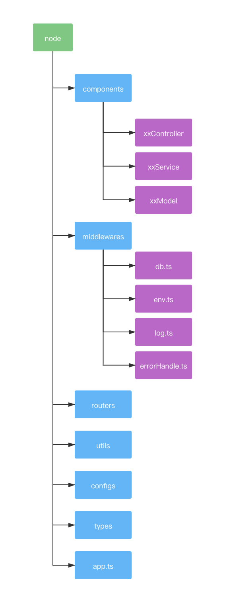

# 最佳实践

> 参考自：[nodebestpractices](https://github.com/goldbergyoni/nodebestpractices?utm_source=gold_browser_extension)

## 项目结构

**组件式分层**

> 




## COW

[让 Node.js 变“懒”的 COW 技术](https://mp.weixin.qq.com/s/nQ6wHZ4H7ULcvN-rwLP-GA)

> copy-on-write，即复制文件引用技术

### fs.copyFile

**fs.copyFile** 有两个问题：

- 复制相同文件几百次，存在浪费磁盘空间的问题
- 复制到一半断电了怎么办，覆盖内容如何恢复

可以使用 **fs.copyFile**第三个参数

```js
const fs = require('fs');
const fsPromises = fs.promises;
const {
  COPYFILE_EXCL, // 如果目标文件已存在，会报错（默认是覆盖）
  COPYFILE_FICLONE, // 以 copy-on-write 模式复制，如果操作系统不支持就转为真正的复制（默认是直接复制）
  COPYFILE_FICLONE_FORCE, // 强制以 copy-on-write 模式复制，如果操作系统不支持就报错
} = fs.constants;

(async function() {
  try {
    // 三个常量值分别为1、2、4，可以按位或合并传入
    const flags = COPYFILE_FICLONE | COPYFILE_EXCL;
    await fsPromises.copyFile('source.txt', 'destination.txt', flags);
  } catch(e) {
    console.log(e.message);
  }
})();
```

### Cluster

进程在内存中分为代码段、数据段、堆栈段这 3 部分：

- 代码段：存放要执行的代码
- 数据段：存放一些全局数据
- 堆栈段：存放执行的状态

如果每次创建进程，都要复制这三部分内存，很浪费。

**fork**

 fork 只会创建一个新进程，指向父进程的内存，当数据真正修改时，才会复制该部分内存。

**exec**

由于执行的代码段不一样，所以上述三部分内存都会新建。