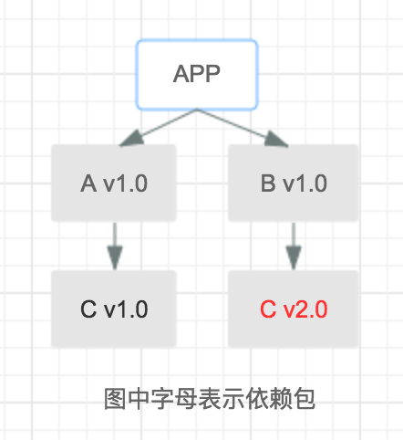
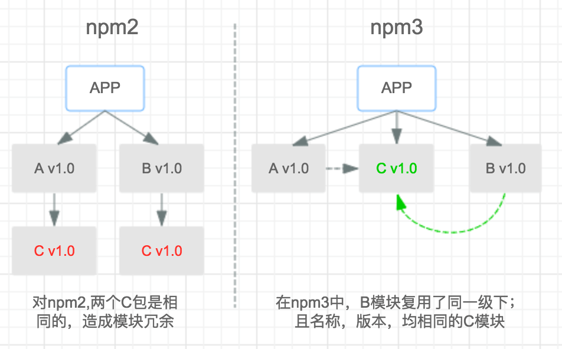
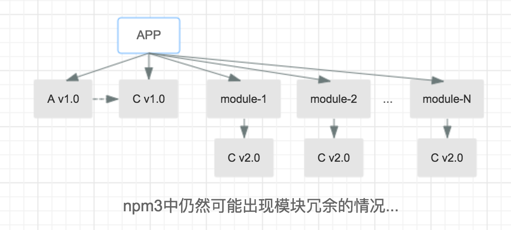

# npm

## 目录
<details>
<summary>展开更多</summary>

* [`基本操作&相关常识`](#基本操作&相关常识)
* [`package.json属性`](#package.json属性)
* [`package-lock`](#package-lock.json)
* [`npm&yarn`](#两者差异)
* [`npm安装原理`](#npm安装原理)
* [`npm script`](#npm-script)

</details>

## 参考
-  https://github.com/diamont1001/blog/issues/11
- [现代化js封装库标准配置](https://github.com/yanhaijing/jslib-base)
- [node依赖管理](https://mp.weixin.qq.com/s/XdOPPay8fpNBiH2ExW_EyQ)

## 基本操作&相关常识

### 相关常识

#### 依赖
- dependencies：正式环境要打包的
- devDependencies：dev环境打包的
- peerDependencies：依赖框架的插件
  * 比如一个express中间件
  ```json
  {
    "name": "my-greate-express-middleware",
    "version": "1.0.0",
    "peerDependencies": {
      "express": "^3.0.0"
    }
  }
  ```
- optionalDependencies：可选，比dependencies优先级高，不建议使用
  * 即使这个依赖安装失败，也不影响整个安装过程
  * 程序应该自己处理安装失败时的情况
- bundledDependencies：数组形式，当使用npm pack（压缩包形式）发布项目时，里面的包也会被一同打包
```json
{
  "name": "awesome-web-framework",
  "version": "1.0.0",
  "bundledDependencies": [
    "renderized", "super-streams"
  ]
}
```
#### 版本
格式：大版本.次要版本.小版本

**大版本**

颠覆性的升级

**次要版本**

兼容同一个大版本内的 API 和用法

**小版本**

修复 bug 或者很细微的变更

#### 符号
- 插入号^：大版本.x.x升级最新版（大版本不升级）
- 波浪号~：大版本.次要版本.x升级最新版（大版本、次要版本不升级）
- latest：最新版
- alpha.x、beta.x、rc.x：预发布版本

#### 本地安装包
```json
{
  "dependencies": {
    "bar1": "file:../foo/bar1",
    "bar2": "file:~/foo/bar2",
    "bar3": "file:/foo/bar3"
  }
}
```

### 命令
- 初始化
  - npm init
  - yarn init
- 一键安装
  - npm i
  - npm install
  - yarn
- 指定安装
  - npm i xx -save/-save-dev
  - npm install xx -save/-save-dev
  - yarn add xx 空/-dev/-optional/-peer
- 卸载
  - npm uninstalll xx[@version]
  - yarn remove xx[@version]
- 更新
  - npm update xx[@version]
    - `npm升级会根据package的符号配置，不会直接更新到最新版`
  - yarn upgrade xx[@version]
    - `yarn直接升到最新版`
- 锁
  - yarn.lock
  - package-lock.json

### npm发布
- npm c ls
- npm config list
- npm config set @aa:registry http://r.npm.aa.com
  - `查看npm配置`
- npm login [--register=...]
  - `指定域登录（如果没登录的话）`
- package.json改版本号
- npm run xxx
  - `发布前打包一下`
- npm publish

### 其他操作

#### 查看模块 owner
- npm owner ls demo

#### 添加一个发布者
- npm owner add 用户名 项目名

#### 删除一个发布者
- npm owner rm 用户名 项目名

---

## package.json属性
* [module](https://github.com/rollup/rollup/wiki/pkg.module)
  - webpack或rollup打包时会优先引入module对应的文件
  - 主要用于做依赖分析，或npm包的复用
  - module属性是非标准属性，可参考[pr](https://github.com/browserify/resolve/pull/187)

---

## package-lock.json
npm官网建议：把 package-lock.json 一起提交到代码库中，不要 ignore。
但是在执行 npm publish 的时候，它会被忽略而不会发布出去。

### 依赖包版本管理
- 在大版本相同的前提下，模块在package.json中的小版本 > lock.json时，
  将安装该大版本下最新版本
- 在大版本相同的前提下，模块在package.json中的小版本 < lock.json时，
  使用lock.json中的版本
- 在大版本不同的前提下，将根据package.json中大版本下最新版本进行更新
- package.json中有记录，lock.json没记录，install后lock.json生成记录


---

## 两者差异

### 安装方式
npm：串行的安装
yarn：并行安装

### 离线可用
npm：默认全部请求，5.x版本之后，支持`npm install xxx —prefer-offline`优先使用缓存
yarn：默认支持，即使用本地缓存

### 控制台信息
npm：会列出完整依赖树
yanr：直接输出安装结果，报错日志清晰

---

## npm安装原理
1. preinstall
2. 确定首层依赖模块
3. 获取模块
  - package.json拿version、resolved等字段
  - 根据resolved到本地找缓存，没有再从仓库下载
  - 查找当前模块是否有依赖，有的话回到1
4. 模块扁平化
  - 所有模块放到根节点（npm3加入的dedupe）
  - 当发现有重复模块时，则将其丢弃（由于存在版本兼容范围，所以不一定要版本完全一致）
6. 执行工程自身生命周期
  - install
6. postinstall + prepublish + prepare

### npm2安装机制

弊端：相同模块大量冗余

### npm3安装机制

弊端：相同模块部分冗余，如下图：


### npm5
增加了 package-lock.json

### npm去重
npm dedupe

---

## npm-script

### npm run
- 本地自动新建一个shell
- 将node_modules/.bin的绝对路径加入PATH，执行
- 结束后PATH恢复原样

### 参数传递
```js
npm run serve --params  // 参数params将转化成process.env.npm_config_params = true

npm run serve --params=123 // 参数params将转化成process.env.npm_config_params = 123

npm run serve -params  // 等同于--params参数

npm run serve params  // 将params参数添加到process.env.argv数组中

npm run serve -- --params  // 将--params参数添加到process.env.argv数组中

npm run serve -- params  // 将params参数添加到process.env.argv数组中
```

### 多命令运行

#### &&
- 串行执行
- 只要一个命令执行失败，则整个脚本终止

#### &
- 并行执行
- 第三方管理模块
  * script-runner
  * npm-run-all
  * redrun
