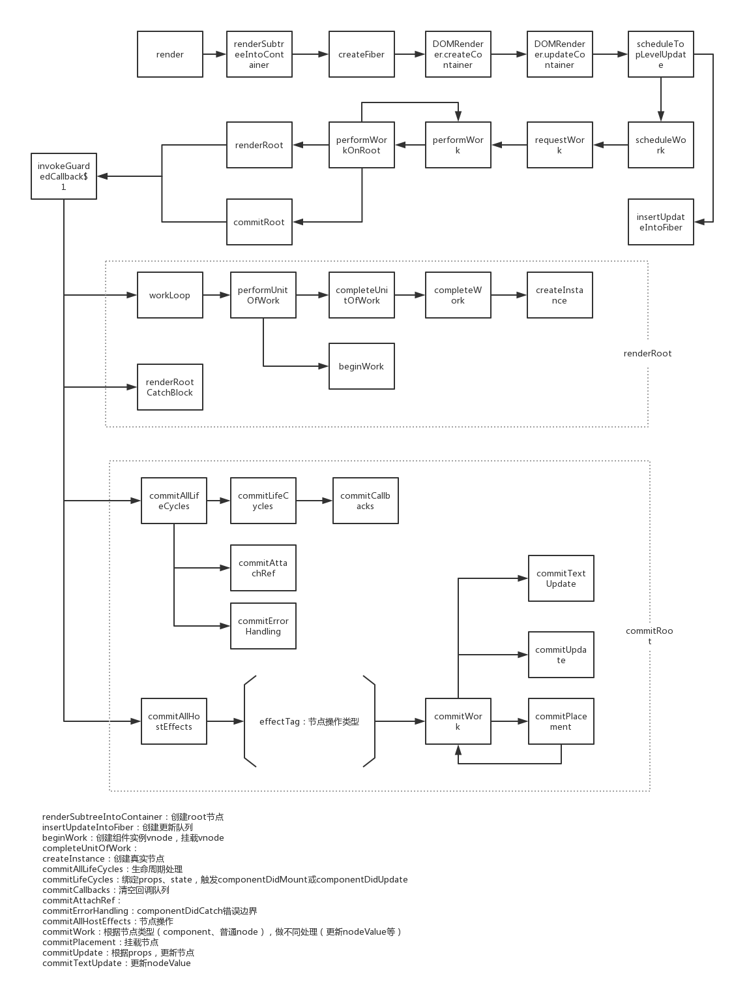
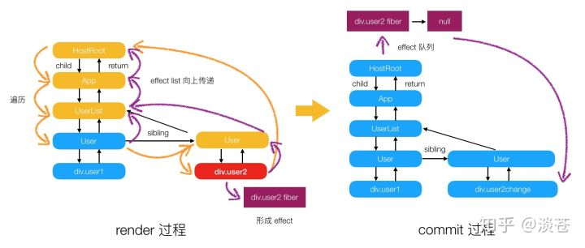
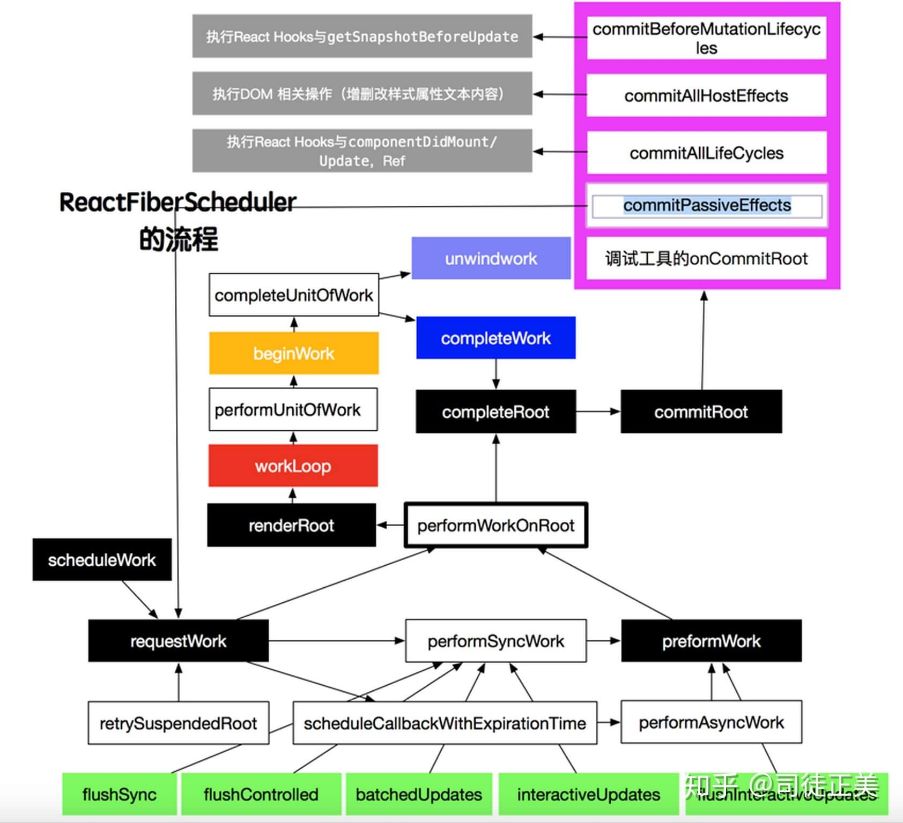
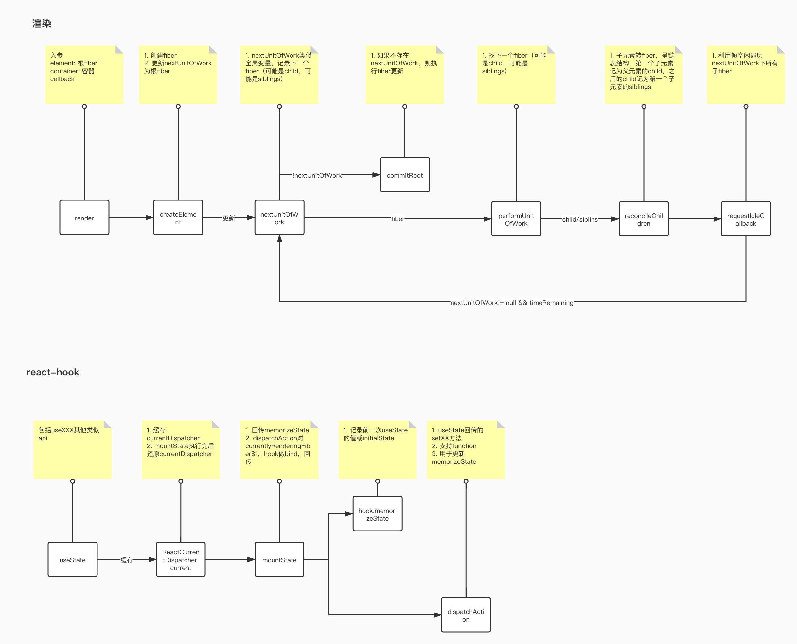

# react16+

## 参考
- [react揭秘](https://react.iamkasong.com)
- [16.3 升级指南](https://zcfy.cc/article/update-on-async-rendering)
- 解析过程见 ./src/mobx/react16-*.png
- vdom 见 https://zhuanlan.zhihu.com/p/35876032
- [fiber](https://zhuanlan.zhihu.com/p/37098539)
- [HOC 复用和拆分](https://zhuanlan.zhihu.com/p/40245156)
- [react-redux](https://segmentfault.com/a/1190000012976767)
- [react17](https://zhuanlan.zhihu.com/p/46147401)
- [redux 大型项目](https://zhuanlan.zhihu.com/p/47396514)
- [react16 新特性](https://zhuanlan.zhihu.com/p/52016989?utm_source=75weekly&utm_medium=75weekly)
- [Dan 对 react 内部的解释](https://overreacted.io/)
- [react-christmas](https://react.christmas)
- [Vuex、Flux、Redux、Redux-saga、Dva、MobX](https://zhuanlan.zhihu.com/p/53599723)
- [ReactFiber 在并发模式下的运行机制](https://zhuanlan.zhihu.com/p/54042084)
- [TypeScript 2.8 下的终极 React 组件模式](https://juejin.im/post/5b07caf16fb9a07aa83f2977)
- [create-react-app in docker](https://mherman.org/blog/dockerizing-a-react-app/)
- [React + Typescript 工程化治理实践](https://github.com/ProtoTeam/blog/blob/master/201911/2.md)
- [react hook](https://juejin.im/post/5e38cca251882549003d07e7?utm_source=gold_browser_extension)
- [react hook 最佳实践](https://juejin.im/post/5ec7372cf265da76de5cd0c9)
- [react技术揭秘](https://react.iamkasong.com/#%E7%AB%A0%E8%8A%82%E5%88%97%E8%A1%A8)
- [借鉴react的库-solidjs](https://www.solidjs.com/)
- [preact diff原理](https://mp.weixin.qq.com/s/2v2tSDOdjm4bZB23MxVh-g)

## 目录

<details>
<summary>展开更多</summary>

* [`相关库`](#相关库)
* [`lifecycle`](#lifecycle)
* [`更新过程`](#更新过程)
* [`react16之前`](#react16之前)
* [`react16`](#react16)
* [`react16.13`](#react16.13原理)
* [`react17`](#react17)
* [`内部构造`](#内部构造)
* [`redux大型项目构建`](#redux大型项目构建)
* [`React Hooks`](#ReactHooks)
* [`React进阶`](#React进阶)
* [`concurrent`](#concurrent)
* [`contextAPI`](#contextAPI)
* [`rn`](#rn)
* [`interview`](#interview)
* [`优化指南`](#优化指南)
* [`react+ts`](#react+ts)
* [`create react app`](#create-react-app)
* [`react router`](#react-router)

</details>

## 相关库

1. ckeditor： https://ckeditor.com/blog/best-wysiwyg-editor-for-angular-react/
2. react 可视化库：https://mp.weixin.qq.com/s/NgaQ4sGI4RDXb23ua2Spbw

---

## lifecycle


```js
class ExampleComponent extends React.Component {
  // 用于初始化 state
  constructor() {}
  // 用于替换 `componentWillReceiveProps` ，该函数会在初始化和 `update` 时被调用
  // 因为该函数是静态函数，所以取不到 `this`
  // 如果需要对比 `prevProps` 需要单独在 `state` 中维护
  static getDerivedStateFromProps(nextProps, prevState) {}
  // 判断是否需要更新组件，多用于组件性能优化
  shouldComponentUpdate(nextProps, nextState) {}
  // 组件挂载后调用
  // 可以在该函数中进行请求或者订阅
  componentDidMount() {}
  // 用于获得最新的 DOM 数据
  getSnapshotBeforeUpdate() {}
  // 组件即将销毁
  // 可以在此处移除订阅，定时器等等
  componentWillUnmount() {}
  // 组件销毁后调用
  componentDidUnMount() {}
  // 组件更新后调用
  componentDidUpdate() {}
  // 渲染组件函数
  render() {}
  // 以下函数不建议使用
  UNSAFE_componentWillMount() {}
  UNSAFE_componentWillUpdate(nextProps, nextState) {}
  UNSAFE_componentWillReceiveProps(nextProps) {}
}
```

---

## 更新过程

- shouldComponentUpdate
- componentWillUpdate
- render
- componentDidUpdate

---

## react16 之前

- 自顶向下递归解析，生成虚拟节点
- 通过 diff 算法，生成变更 patch
- patch 放到更新队列
- 无法中断，直到整棵虚拟节点树解析完成，将线程交给渲染引擎

### diff 策略

1. 针对 input、option、select、textarea 做了特殊处理
2. 针对 dom 属性做处理
  * style
  * 其他属性
3. 针对 dom&dom 子节点做处理
  * text 不同 => updateTextContent
  * key、type 不同 => 节点增、删、改

---

## react16

[requestIdleCallback](../js&browser/requestIdleCallback.md)

### fiber

- 虚拟的堆栈帧
- 存在优先级
- 时间分片

#### 结构

- return: 父节点
- sibling: 下一个兄弟节点
- child: 子节点
- alternate: current-tree <==> workInProgress-tree 对应的 fiber

### first-render

**调用过程**



**动画演示**

图中垂直方向是 sibling 的关系


1. render 阶段

* React.createElement 创建 element-tree
* 每个 element 绑定 fiber，记录上下文信息
* fiber-tree => current-tree
* setState 会重建 element，更新 fiber 的必要属性

2. schedule 阶段

* schedule work
  + 根据 fiber 找其根节点 root（找不到则会根据 fiber 类型，出 warnUnmounted）
  + 查找过程更新每个 fiber 的 expirationTime
* request work
  + 将 root-fiber 提上 schedule
* perform work
  + 构造 workInProgress-tree
  + current 指向新的 fiber
* begin work
  + 返回指向要在循环中处理的下一个子节点的指针或 null

3. reconcile 阶段

* reconcilation
  + 遍历 fibers，diff 出 effectlist（各种变更信息）给 commit 阶段
* commit
  + commitRoot 根据 effect 的 effectTag，分别做增、删、改等操作
  + 最终将结果反映到真实 dom

### diff 策略

reconcileChildFibers

#### 简易流程

- 首次渲染创建 current 树
- 处理变更时，创建 workInProgress 树
- 所有操作在 workInProgress 树进行
- 操作完，将 workInProgress 树变更反应到页面上
- workInProgess 树替换 current 树

#### 判断 fiber 类型

- text 节点
- 单个 element
- element 数组

#### text 节点

- 如果第一个节点是 text 节点
  * 删除剩余 sibling 节点
  * 复用第一个节点
- 如果第一个节点不是 text 节点
  * 删除当前及其 sibiling 节点
  * 创建 text 节点

注：删除只是打上 tag=delete，真正在 commit 时删除

#### 单个 element 节点

- props
- 如果 key、type 相同
  * 删除老 fiber 的 siblings
  * 复用老 fiber
- 如果 key、type 不同
  * 在当前 fiber 及 siblings 里找 key 相同的，复用
  * 找不到的话，删除当前 fiber，创建新 fiber
- 如果 key 相同、type 不同
  * 复用老 fiber，删除 siblings

#### element 数组

- 遍历
- 如果 newChild 是 text 节点
  * 老 fiber 有 key 的话（说明是 element），不能复用，返回 null
  * 老 fiber 没有 key 的话，复用
- 如果 newChild 是 element 节点
  * 根据 key、type 判断是否可复用

#### 整个流程

1. 新老 fiber 的 index 对比，用 updateSlot 找可复用的 fiber（kty、type）
2. 老 fiber 数和新 fiber 数对比，老 < 新，新 fiber 插入，否则老 fiber 批量删除
3. 老 fiber 按 key、index 存到 map，遍历新数组，做老元素移动/插入处理

### 对比差异

- react16 将渲染阶段分为三段（render，diff，commit）
- fiber 是链表形式
- 每个 fiber 有 expirationTime、优先级（用于在 commit 阶段做时间分片渲染）

**注：一开始用的 Priority，后来改为 expirationTime， 之后又改为递减的 expirationTime**

### 一些问题

#### 虚拟节点和 fiber 区别

- 虚拟节点描述的还是 node
- fiber 是虚拟节点的抽象表示，类似一个工作单元，便于中断挂起

#### 拆分维度

按虚拟节点 element 拆

#### 如何调度

- 工作循环
- fiber 优先级

每次工作单元处理完，判断当前帧是否有空余时间，
没有的话，用 requestIdleCallback 回调执行

#### 中断/断点恢复

- fiber 保存当前进度（firstEffect、lastEffect）
- 修改 effectTag（Update、Snapshot、Deletion、Placement）

---

## redux 大型项目构建

### 使用索引（index）存储数据，使用选择器（selector）访问数据

#### 使用索引（index）存储数据

```js
// 接口返回
/*
{
  userList: [
    {
      id: 123,
      name: abc,
      // ...
    },
    // ...
  ],
}
*/

// 前端存储（转换成散列表索引）
/*
{
  userList: {
    123: {
      id: 123,
      name: abc,
      // ...
    },
    // ...
  },
}
 */
```

#### 使用选择器（selector）访问数据

```js
const getUserList = ({ userMap }) => (
  Object.keys(userMap).map(key => userMap[key])
);

const getSelectedUserList = ({ selectedIdList, userMap }) => (
  selectedIdList.map(id => userMap[id])
);
```

### 状态隔离

```js
// 只有view状态
/*
{
  userList: {
    123: {
      id: 123,
      name: abc,
      // ...
    },
    // ...
  },
}
*/

// 新增edit状态
/*
{
  userList: {
    123: {
      id: 123,
      name: abc,
      // ...
    },
    // ...
  },
  editingUserList: {
    123: {
      id: 123,
      name: abc,
      // ...
    },
    // ...
  },
}

 */
```

### 重用 reducer

#### 作用域（scope）或者前缀（prefix）对动作类型（types）进行特殊处理

```js
const initialPaginationState = {
  startElement: 0,
  pageSize: 100,
  count: 0,
};

const paginationReducerFor = (prefix) => {
  const paginationReducer = (state = initialPaginationState, action) => {
    const { type, payload } = action;
    switch (type) {
      case prefix + types.SET_PAGINATION:
        const {
          startElement,
          pageSize,
          count,
        } = payload;
        return Object.assign({}, state, {
          startElement,
          pageSize,
          count,
        });
      default:
        return state;
    }
  };
  return paginationReducer;
};

// 加前缀
const usersReducer = combineReducers({
  usersData: usersDataReducer,
  paginationData: paginationReducerFor('USERS_'),
});

const domainsReducer = combineReducers({
  domainsData: domainsDataReducer,
  paginationData: paginationReducerFor('DOMAINS_'),
});
```

---

## React 进阶

[参考](https://juejin.im/post/5c92f499f265da612647b754?utm_source=gold_browser_extension)

### Fiber

**更新流程**

- reconciliation
  * 更新 state/prop
  * life hooks
  * 生成 fiber tree
  * diff
- render
  * Fiber 节点打上 effectTag
  * effectTag 代表了 Fiber 节点做了怎样的变更
  * 具有 effectTag 的 Fiber 会成为 effect
  * 随 completeUnitOfWork 过程向上收集
- commit
  * 节点更新（若需）

**结构**

```js
class Fiber {
  constructor() {
    this.instance = instance;
    this.return = parent;
    this.child = child;
    this.siblings = firstBrotherNode;
  }
}
```

**链表树遍历算法**

- 深度遍历 child，到树末尾
- siblings
- 返回 return 节点，重复 siblings
- 直至 root




**伪代码**

```js
while (当前还有空闲时间 && 下一个节点不为空) {
  下一个节点 = 子节点 = beginWork(当前节点);
  if (子节点为空) {
    下一个节点 = 兄弟节点 = completeUnitOfWork(当前节点);
  }
  当前节点 = 下一个节点;
}
```

**解决进程阻塞**

- 任务分割
- 异步调用
- 缓存策略

### 生命周期

---

## concurrent

未来版本 react 会推出 concurrent 模式，与当前版本 sync 区别可[参考](https://zhuanlan.zhihu.com/p/60307571)

### 差异图

[sync VS concurrent](./syncVSconcurrent.jpg)

### 任务优先级

* expiration time
  - fiber 设置过期时间，防止低优任务被高优任务耽误，导致一直不执行
  - 高低优任务对应的 expiration time 有改动，不绝对
* Sync > InteractiveExpiration（事件中触发比如 blur、click） > AsyncExpiration

---

## contextAPI

[Unstated Next](https://github.com/jamiebuilds/unstated-next)

封装 react 的 contextAPI，模拟状态管理

---

## rn


---

## interview

[react 的 304 道题](https://github.com/semlinker/reactjs-interview-questions)

---

## 优化指南

[参考](https://mp.weixin.qq.com/s/R2oGuX-WT8Muwiur8vo0qw)

### React.Fragment

>

> 作用：
>
> 1. 用于包裹组件中的子节点，但是不产生额外节点

```js
// 正常用法
class Columns extends React.Component {
  render() {
    return (
      <React.Fragment>
        <td>column one</td>
        <td>column two</td>
      </React.Fragment>
    );
  }
}

// 简洁用法
class Columns extends React.Component {
  render() {
    return (
      <>
        <td>Hello</td>
        <td>World</td>
      </>
    );
  }
}
```

### React.lazy

>

> 作用：
>
> 1. 只有当组件需要渲染时才会加载组件
> 2. 必须使用 `import()` 加载
> 3. 返回值必须是 `Promise`，加载的是 `export default`

```js
const OtherComponent = React.lazy(() => import('./OtherComponent'));

function MyComponent() {
  return (
    <div>
      <OtherComponent />
    </div>
  );
}
```

### React.suspense

>

> 作用：
>
> 1. `React.lazy` 加载前，需要类似【加载中】的状态展示，可用 `suspense`
> 2. `suspense` 里可以套多个 `React.lazy`
> 3. 加载态放在 `fallback` 属性里

```js
const OtherComponent = React.lazy(() => import('./OtherComponent'));
const AnotherComponent = React.lazy(() => import('./AnotherComponent'));

function MyComponent() {
  return (
    <div>
      <Suspense fallback={<div>Loading...</div>}>
        <section>
          <OtherComponent />
          <AnotherComponent />
        </section>
      </Suspense>
    </div>
  );
}
```

### shouldComponentUpdate

>

> 自定义比较 `props` 和 `state`，避免组件无意义 render

### React.PureComponent

>

> 浅比较 `props` 和 `state`

### React.memo

>

> 描述：
>
> 1. 高阶组件，类似 `React.PureComponent`
> 2. 默认也只做浅比较，不过可以传入自定义比较函数

```js
const MyComponent = ({user}) =>{
    const {name, occupation} = user;
    return (
        <div>
            <h4>{name}</h4>
            <p>{occupation}</p>
        </div>
    )
}
// 比较函数
function areEqual(prevProps, nextProps) {
  /*
  如果把 nextProps 传入 render 方法的返回结果与
  将 prevProps 传入 render 方法的返回结果一致则返回 true，
  否则返回 false
  */
}
export default React.memo(MyComponent, areEqual);
```

### 虚拟列表

- react-window
- react-virtualized

---

## react+ts

### ESLint 和 Prettier

> TSLint 在 2019 年宣布未来项目将会废弃，TS 官方推荐 ESLint 作为 Linter

- @typescript-eslint/parser: 解析器
- @typescript-eslint/eslint-plugin: 规则集

#### JS+TS 混合项目

> ESLint 的 override

只对 .ts 文件加入规则校验

```json
"overrides": [
  {
    "files": "**/*.ts",
    "extends": [
      "eslint-config-airbnb",
      "plugin:@typescript-eslint/recommended",
      "prettier/@typescript-eslint",
      "prettier",
      "prettier/react"
    ],
  }
]
```

#### pre-commit hook

### module

- commonjs
- es module

### mono-repo

### 单元测试-jest

---

## ReactHooks

- [精简实现hooks](https://mp.weixin.qq.com/s/YLSD4IojDWTPlov_RQtVAA)
- [使用必读](https://zhuanlan.zhihu.com/p/113216415)

### 方法
- useState
- useMemo - 缓存数据、方法等
- useEffect - mounted后触发
- useCallback - 缓存方法（useMemo可替代）
- useRef - 缓存数据（useMemo可替代）

### 实现

```js
const [num, updateNum] = useState(0);
```

`hook`

```js
hook = {
  queue: {
    pending: null, // 保存update的queue，即上文介绍的queue
  },
  // 保存hook对应的state
  memoizedState: initialState,
  // 与下一个Hook连接形成单向无环链表
  next: null,
}
```

`updateNum`

```js
function dispatchAction(queue = hook.queue, action) {
  // ...创建update
  const update = {
    action,
    next: null,
  };

  // ...环状单向链表操作
  if (queue.pending === null) {
    update.next = update;
  } else {
    update.next = queue.pending.next;
    queue.pending.next = update;
  }

  queue.pending = update;

  // ...模拟React开始调度更新
  schedule();
}
```

---

## create-react-app
[参考](https://create-react-app.dev/docs/adding-typescript)
一般来说初始化带typescript即可
```
npx create-react-app my-app --template typescript
```

---

## react-router
[参考](https://reactrouter.com/web/example/basic)

router默认不做按需加载处理，需要[手动实现](https://blog.csdn.net/jacktesla/article/details/80792110?utm_medium=distribute.pc_relevant_download.none-task-blog-baidujs-2.nonecase&depth_1-utm_source=distribute.pc_relevant_download.none-task-blog-baidujs-2.nonecase)

---

## react16.13原理

### 核心api
- React.createElement: 创建虚拟DOM
- React.Component: 实现自定义组件
- ReactDOM.render: 渲染真实DOM

### 实现


### fiber遍历顺序
```
子 =》 子的兄弟 => 没有兄弟了=> 父元素
```

### 最简实现
> 来自开课吧大圣实现

```js
function createElement(type, props, ...children) {
  delete props.__source
  return {
    type,
    props: {
      ...props,
      children: children.map(child =>
        typeof child === "object"
          ? child
          : createTextElement(child)
      ),
    },
  }
}
function createTextElement(text) {
  return {
    type: "TEXT",
    props: {
      nodeValue: text,
      children: [],
    },
  }
}
function createDom(vdom){
  const dom = vdom.type === "TEXT"
    ? document.createTextNode("")
    : document.createElement(vdom.type)

  updateDom(dom, {}, vdom.props)
  return dom
}

// dom更新
function updateDom(dom, prevProps, nextProps) {
    Object.keys(prevProps)
    .filter(name=>name!=="children")
    .filter(name=> !(name in nextProps))
    .forEach(name => {
      // 删除
      if(name.slice(0,2)==='on'){
        dom.removeEventListener(name.slice(2).toLowerCase(), prevProps[name],false)
      }else{
        dom[name] = ''
      }
    })

    Object.keys(nextProps)
    .filter(name=>name!=="children")
    .forEach(name => {
      // 删除
      if(name.slice(0,2)==='on'){
        dom.addEventListener(name.slice(2).toLowerCase(), nextProps[name],false)
      }else{
        dom[name] = nextProps[name]
      }
    })

}


function commitRoot() {
  deletions.forEach(commitWork)
  commitWork(wipRoot.child)
  // 取消wip
  currentRoot = wipRoot
  wipRoot = null
}

function commitWork(fiber) {
  if (!fiber) {
    return
  }
  let domParentFiber = fiber.parent
  while (!domParentFiber.dom) {
    domParentFiber = domParentFiber.parent
  }
  const domParent = domParentFiber.dom

  if (
    fiber.effectTag === "PLACEMENT" &&
    fiber.dom != null
  ) {
    domParent.appendChild(fiber.dom)
  } else if (
    fiber.effectTag === "UPDATE" &&
    fiber.dom != null
  ) {
    updateDom(
      fiber.dom,
      fiber.base.props,
      fiber.props
    )

  } else if (fiber.effectTag === "DELETION") {
    commitDeletion(fiber, domParent)
  }
  commitWork(fiber.child)
  commitWork(fiber.sibling)
}
function commitDeletion(fiber, domParent) {
  if (fiber.dom) {
    domParent.removeChild(fiber.dom)
  } else {
    commitDeletion(fiber.child, domParent)
  }
}

function render(vdom, container){
  // 设置全局 nextUnitOfWork 
  wipRoot = {
    dom: container,
    props: {
      children: [vdom],
    },
    base: currentRoot,
  }
  deletions = []
  nextUnitOfWork = wipRoot
}


let nextUnitOfWork = null
// 工作中的fiber
let wipRoot = null
let currentRoot = null
let deletions = null
// 任务调度
function workLoop(deadline) {
  // 有任务，并且当前帧还没结束
  // 没考虑到超时( deadline.didTimeout
  while (nextUnitOfWork && deadline.timeRemaining()>1) {
    // 获取下一个任务单元
    nextUnitOfWork = performUnitOfWork(
      nextUnitOfWork
    )
  }
  // 没有下个任务了 提交修改
  if (!nextUnitOfWork && wipRoot) {
    commitRoot()
  }
  requestIdleCallback(workLoop)
}
requestIdleCallback(workLoop)
function performUnitOfWork(fiber) {
  const isFunctionComponent = fiber.type instanceof Function
  if (isFunctionComponent) {
    updateFunctionComponent(fiber)
  } else {
    updateHostComponent(fiber)
  }
  if (fiber.child) {
    return fiber.child
  }
  let nextFiber = fiber
  while (nextFiber) {
    if (nextFiber.sibling) {
      return nextFiber.sibling
    }
    nextFiber = nextFiber.parent
  }
}

function useState(init){
  const oldHook =
  wipFiber.base &&
  wipFiber.base.hooks &&
  wipFiber.base.hooks[hookIndex]
  const hook = {
    state: oldHook ? oldHook.state : init,
    queue: [],
  }
  const actions = oldHook ? oldHook.queue : []
  actions.forEach(action => {
    hook.state = action
  })
  const setState = action => {
    hook.queue.push(action)
    wipRoot = {
      dom: currentRoot.dom,
      props: currentRoot.props,
      base: currentRoot,
    }
    nextUnitOfWork = wipRoot
    deletions = []
  }
  wipFiber.hooks.push(hook)
  hookIndex++
  return [hook.state, setState]
}
let wipFiber = null
let hookIndex = null

function updateFunctionComponent(fiber) {
  wipFiber = fiber
  hookIndex = 0
  wipFiber.hooks = []

  // 执行函数，传入props
  const children = [fiber.type(fiber.props)]
  reconcileChildren(fiber, children)
}
function updateHostComponent(fiber) {
  if (!fiber.dom) {
    fiber.dom = createDom(fiber)
  }
  reconcileChildren(fiber, fiber.props.children)
}
function reconcileChildren(wipFiber, elements) {
  let index = 0
  let oldFiber =
    wipFiber.base && wipFiber.base.child
  let prevSibling = null
  while (
    index < elements.length ||
    oldFiber != null
  ) {
    const element = elements[index]
    let newFiber = null
    // 对比
    const sameType =
      oldFiber &&
      element &&
      element.type === oldFiber.type
    if (sameType) {
      // update the node
      newFiber = {
        type: oldFiber.type,
        props: element.props,
        dom: oldFiber.dom,
        parent: wipFiber,
        base: oldFiber,
        effectTag: "UPDATE",
      }
    }
    if (element && !sameType) {
      // add this node
      newFiber = {
        type: element.type,
        props: element.props,
        dom: null,
        parent: wipFiber,
        base: null,
        effectTag: "PLACEMENT",
      }
    }
    if (oldFiber && !sameType) {
      // delete the oldFiber's node
      oldFiber.effectTag = "DELETION"
      deletions.push(oldFiber)
    }

    if (oldFiber) {
      oldFiber = oldFiber.sibling
    }
    if (index === 0) {
      wipFiber.child = newFiber
    } else if (element) {
      prevSibling.sibling = newFiber
    }
    prevSibling = newFiber
    index++
  }

  

}

class Component {
  constructor(props){
    this.props = props
    // this.state = {}
  }
}
function useComponent(Component){
  return function(props){
    const component = new Component(props)
    // eslint-disable-next-line react-hooks/rules-of-hooks
    let [state, setState] = useState(component.state)
    component.props = props
    component.state = state
    component.setState = setState
    console.log(component)
    return component.render()
  }
}


export default {
  createElement,
  render,
  useState,
  Component,
  useComponent
}
```

---

## react17

[启发式更新算法](https://mp.weixin.qq.com/s/E1tsUT2EldaFxhwNplXr1g)

react16通过fibter.expirationTime >= expirationTime来决定是否更新

react17新增lanes（车道）概念，将更新形式归类为31种，如果当前更新形式已经占用了lane，则降低优先级，寻找下一个lane，方便IO操作和CPU操作

---

## 内部构造

### errorBoundary
[不用try catch，如何机智的捕获错误](https://mp.weixin.qq.com/s/ne7Ts5fagf6xFq7mNhr2ng)

> 由于errorBoundary会捕获异常，会导致`Pause on exceptions`失效，不利于线下调试，故react做了类似如下处理：

```js
function wrapperDev(func) {
  function handleWindowError(error) {
    // 收集错误交给Error Boundary处理
  }
  
  function callCallback() {
    fakeNode.removeEventListener(evtType, callCallback, false); 
    func();
  }
  
  const event = document.createEvent('Event');
  const fakeNode = document.createElement('fake');
  const evtType = 'fake-event';

  window.addEventListener('error', handleWindowError);
  fakeNode.addEventListener(evtType, callCallback, false);

  event.initEvent(evtType, false, false);
  
  // 触发callCallback的执行
  // 由于是事件触发，抛错不会阻止后续代码的运行，但是却能被`Pause on exceptions`捕获
  fakeNode.dispatchEvent(event);
  
  window.removeEventListener('error', handleWindowError);
}
```
