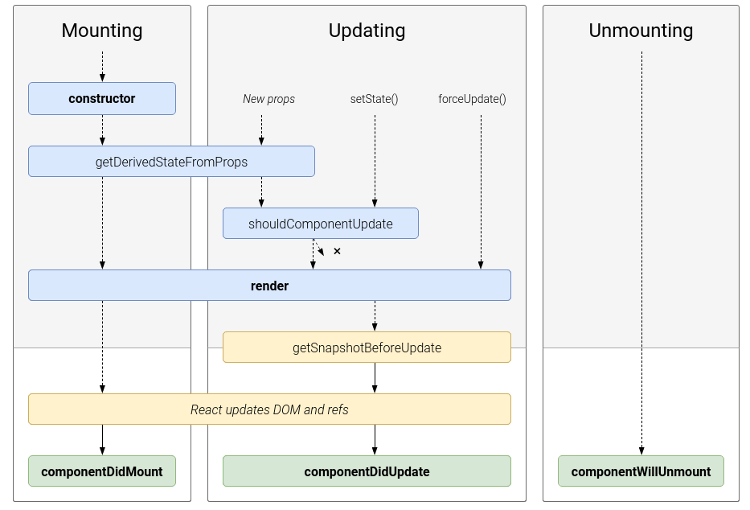
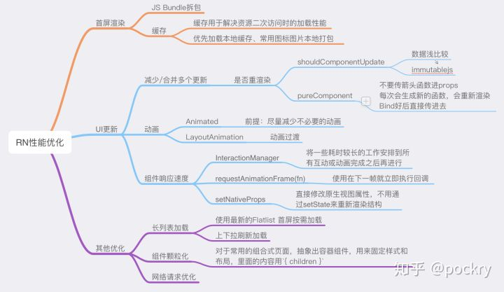

# react16+

## 参考
1. 16.3升级指南：https://zcfy.cc/article/update-on-async-rendering
2. 
2. 
3. 解析过程见 ./src/mobx/react16-*.png
4. vdom见 https://zhuanlan.zhihu.com/p/35876032
5. fiber：https://zhuanlan.zhihu.com/p/37098539

## lifecycle
  - componentWillReceiveProps (nextProps)
  - static getDerivedStateFromProps()
  - shouldComponentUpdate
  - componentWillUpdate
  - render
  - getSnapshotBeforeUpdate()
  - componentDidUpdate

## 更新过程
  - shouldComponentUpdate
  - componentWillUpdate
  - render()
  - componentDidUpdate

