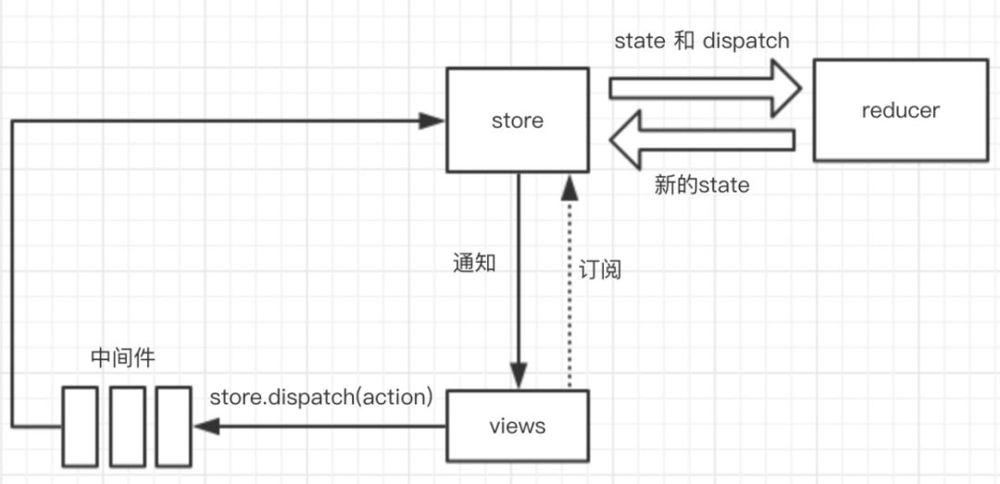

# redux

## 关键名词

### createStore
创建 store 对象，包含 getState, dispatch, subscribe, replaceReducer

### reducer
reducer 是一个计划函数，接收旧的 state 和 action，纯函数生成新的 state

### action
action 是一个对象，必须包含 type 字段

### dispatch
dispatch( action ) 触发 action，生成新的 state

### subscribe
实现订阅功能，每次触发 dispatch 的时候，会执行订阅函数

### combineReducers
多 reducer 合并成一个 reducer

### replaceReducer
替换 reducer 函数

### middleware
扩展 dispatch 函数！

## 流程
