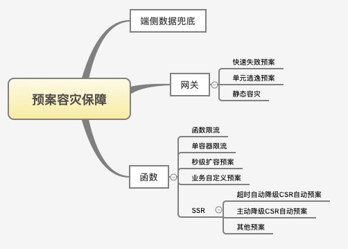

# serverless

## 参考
- [solid](https://learnsolid.cn/)
- [rax-serveless实践](https://mp.weixin.qq.com/s/Hj1Py3_CNedxq0ZAy51Qqw)
- [Node.js Serverless助力双11](https://mp.weixin.qq.com/s/l38ZhVP1RboOEsJI1lUHJQ)
- [云函数平台-val town](https://www.val.town/)

## 名词解释

**FAAS - Function as a service**

函数即服务，每一个函数都是一个服务，函数可以由任何语言编写，除此之外不需要关心任何运维细节，比如：计算资源、弹性扩容，而且可以按量计费，且支持事件驱动。业界大云厂商都支持 FAAS，各自都有一套工作台、或者可视化工作流来管理这些函数。

**BAAS - Backend as a service**

后端即服务，就是集成了许多中间件技术，可以无视环境调用服务，比如数据即服务（数据库服务），缓存服务等。虽然下面还有很多 XASS，但组成 Serverless 概念的只有 FAAS + BAAS。

**PAAS - Platform as a service**

平台即服务，用户只要上传源代码就可以自动持续集成并享受高可用服务，如果速度足够快，可以认为是类似 Serverless。但随着以 Docker 为代表的容器技术兴起，以容器为粒度的 PASS 部署逐渐成为主流，是最常用的应用部署方式。比如中间件、数据库、操作系统等。

**DAAS - Data as a service**

数据即服务，将数据采集、治理、聚合、服务打包起来提供出去。DASS 服务可以应用 Serverless 的架构。

**IAAS - Infrastructure as a Service**

基础设施即服务，比如计算机存储、网络、服务器等基建设施以服务的方式提供。

**SAAS - Software as a Service**

软件即服务，比如 ERP、CRM、邮箱服务等，以软件为粒度提供服务。

## 架构

### 优势
[云开发](https://mp.weixin.qq.com/s/Ytt5rsFCtsxNmK4Hbf483w)
- 尽可能简单，不引入不必要的依赖，尽可能减少依赖；
无状态设计，各个模块均是无状态的，便于在系统请求量上升时快速- 进行横向扩容；
可降级设计，链路中各个模块均进行可降级设计，在单个模块出现问- 题时，可自动或手动降级到备用方案，并且有兜底方案；
- 多级缓存设计，在系统内部存在多级别的缓存设计，提升系统性能；
自动故障转移，链路上下游主机可以自动发现和剔除故障主机，快速- 恢复服务；
多集群部署，链路中各个模块均进行了跨机房的多集群部署，在故障- 时能够进行切换；
- 重试策略，针对系统中可重试的场景设计重试机制，保证成功率；
网络策略优化，长连接优化，部分模块内部采用更高效的 RPC 调- 用；
- 采用更高性能的实现方式，减少耗时；
- 快慢请求分离，快请求同步慢请求异步的方式提高性能。

## 容灾预案

