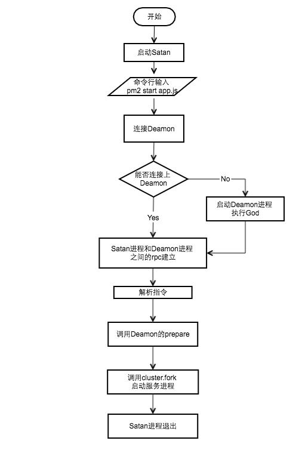

# pm2

## 参考
1. [流程解读](https://www.jianshu.com/p/ac843b516fda)
2. [rpc](https://mp.weixin.qq.com/s/na3uygRGXli_Uvw3fmaNaQ?utm_medium=hao.caibaojian.com&utm_source=hao.caibaojian.com)

## 目录
<details>
<summary>展开更多</summary>

* [`0.4.10流程图`](#0.4.10流程图)
* [`相关概念`](#相关概念)
* [`pm2(v0.4.10)流程`](#pm2(v0.4.10)流程)
* [`pm2(v3.2.2)流程`](#pm2(v3.2.2)流程)
* [`rpc流程`](#rpc流程)
* [`配置`](#配置)
* [`总结`](#总结)

</details>

## 0.4.10流程图


## 相关概念

### rpc
- 远程过程调用
- 过程
  - 客户端与A服务器建立TCP连接
  - A服务器调用B服务器的方法，需要将内存中的参数值，序列化成二进制的形式
  - 通过寻址和传输将序列化的二进制发送给B服务器
  - B服务器反序列化参数，恢复为内存中的表达方式，调用本地方法后，将结果序列化后，返回给A服务器
  - A服务器反序列化，恢复为内存中的表达方式，交给A服务器上的应用
- 相关库
  - axon-rpc
  - axon

### rpc-server
```js
const rpc = require('axon-rpc')
  , axon = require('axon')
  , rep = axon.socket('rep');
 
const server = new rpc.Server(rep);

server.expose({
  add: function(a, b, fn){
    fn(null, a + b);
  },
});

rep.bind(4000);
```

### rpc-client
```js
const rpc = require('axon-rpc')
  , axon = require('axon')
  , req = axon.socket('req');
const req2 = axon.socket('req');
 
var client = new rpc.Client(req);
req.connect(4000);

client.methods(function(err, methods){
  console.log(methods);
});

client.call('add', 1, 2, function(err, n){
  console.log(n);
  // => 3
});
```

### net VS http => createServer
- http.createServer基于net做封装
- [两者对比](http://zhenhua-lee.github.io/node/socket.html/)

### net

#### net.createConnection
  ```js
  const client = net.createConnection({ port: 8124 }, () => {
    //'connect' listener
    console.log('connected to server!');
    client.write('world!\r\n');
  });

  client.on('data', (data) => {
    console.log(data.toString());
    client.end();
  });
  ```

#### net.Socket
  ```js
  const net = require('net');

  const clientSocket = new net.Socket();

  clientSocket.connect({port: 8124}, () => {
    console.log('client connected');
    clientSocket.write('world!\r\n');
  });

  clientSocket.on('data', (data) => {
    console.log(data.toString());
    clientSocket.end();
  });
  ```

#### net-server
  ```js
  const net = require('net');

  const server = net.createServer((c) => {
    console.log('client connected');
    c.on('end', () => {
      console.log('client disconnected');
    });
    // c.write('hello\r\n');
    c.pipe(c);
  });

  server.add = function (a, b, fn) {
    fn(null, a + b);
  };

  server.listen(8124, () => {
    console.log('server bound');
  });
  ```

## pm2(v0.4.10)流程
参考目录下的simple-pm2

## pm2(v3.2.2)流程

### pm2/lib/API.js
```js
class API {
  constructor() {
    // ...
    this.client = new Client({
      // ...
    });

    // ...
    KMDaemon.ping(this._conf, () => {
      // ...
    });
  }

  connect() {
    // ...
    this.client.start();
  }

  start() {
    // ...
  }
}
```

### pm2/lib/Client.js
```js
class Client {
  constructor() {
    // ...
  }

  start() {
    // ...
    this.pingDaemon();
    this.launchDaemon();

    // master进程
    this.daemon = new Daemon({
      // ...
    })
  }

  pingDaemon() {
    var req = axon.socket('req');
    var client = new rpc.Client(req);
    client.socket.once('connect reconnect attempt error' () => {
      // ...
    });
    req.connect(this.rpc_socket_file);
  }

  launchDaemon() {
    var req = axon.socket('req');
    this.client = new rpc.Client(req);
    this.client.socket.once('connect reconnect attempt error' () => {
      // ...
    });
    this.client_sock = req.connect(this.rpc_socket_file);
  }

  close() {
    // ...
    // master挂了，会切断daemon与satan的rpc连接，清空子进程监听
    async.series([
      this.disconnectRPC(),
      this.disconnectBus(),
    ])
  }
}
```

### pm2/lib/Daemon.js
```js
// master进程
class Deamon {
  constructor() {
    // ...
  }

  start() {
    // ...
    const d = domain.create();

   d.once('error', function(err) {
     // ...
     console.error('[PM2] Resurrecting PM2');
     // ...
   });
  }
}
```

### @pm2/agent/src/InteractorClient.js
```js
class KMDaemon {
  static ping() {
    const req = axon.socket('req');
    const client = new rpc.Client(req);
    client.socket.once('connect reconnect attempt error' () => {
      // ...
    });
    req.connect(opts.INTERACTOR_RPC_PORT);
  }
}
```


## 配置

- [pm2全配置参考](https://libin1991.github.io/2019/01/03/Pm2-%E5%B8%B8%E7%94%A8%E9%85%8D%E7%BD%AE%E5%8F%8A%E5%91%BD%E4%BB%A4/)
- [pm2重启策略](https://pm2.keymetrics.io/docs/usage/restart-strategies/#restart-at-cron-time)

docker 建议使用配置文件的形式，比如：

```json
// package.json
{
 "start-pm2": "pm2 start pm2.config.js" 
}
```

```js
// pm2.config.js
module.exports = {
  apps : [
    {
      name: 'pm2-app',
      script: './dist/app.js',
      /**
       * true: 监听到变更会导致 pm2 重启
       *
       * 由于现在 node-server 和测试运行放在一起，
       * 一旦执行测试（会有中间产物出现），导致自动重启，测试运行失败
       * 故置 false
       *
       */
      watch: false,
      // 改用 cluster 模式（默认 fork，fork的优点是能执行非 javascript 代码）
      exec_mode: 'cluster_mode',
      // 每两分钟重启一次
      cron_restart: '*/2 * * * *',
      // 启动进程实例数
      instances: 1,
      log_date_format: 'YY-MM-DD HH:mm:ss Z',
      env: {
        NODE_ENV: 'production',
        HTTP_PROXY: 'http://127.0.0.1:11080',
        NO_PROXY: 'localhost',
      }
    }
  ]
};
```


---

## 总结

1. pm2也是采用cluster.fork实现的集群，由于God Deamon这个Master进程一直执行，
可以保证对每一个子进程监听事件，从而进行相应的操作。
2. pm2的master挂了，会根据pm2_env判断，如果是强制关闭，会重启，如果正常kill，相关子进程也会关闭。
