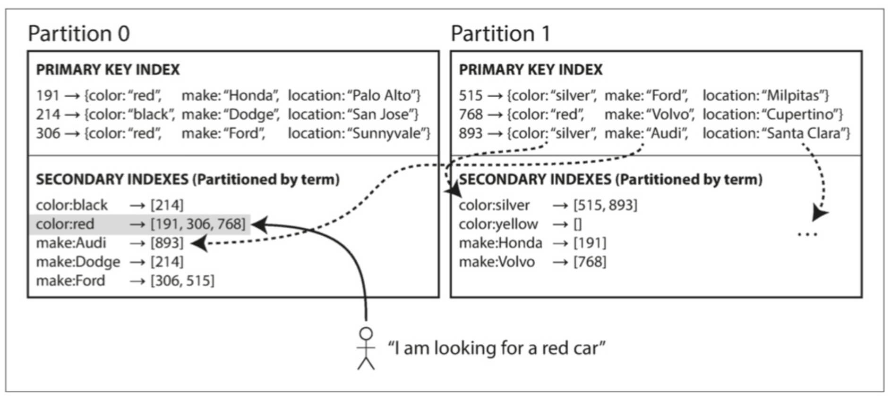
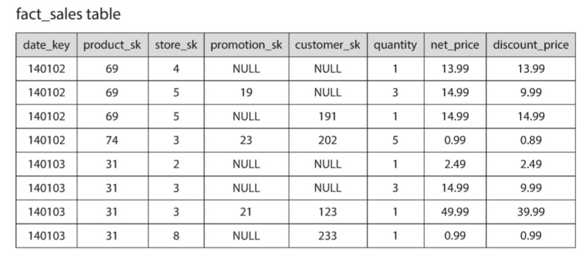
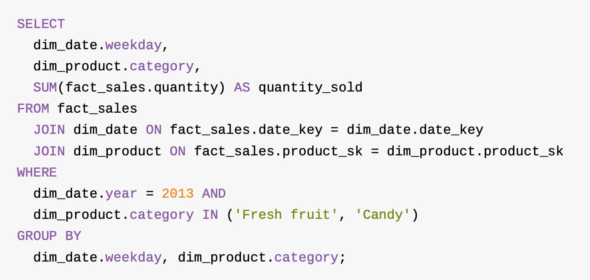

# sql

## 目录
<details>
<summary>展开更多</summary>

* [`概念`](#概念)
* [`索引`](#索引)
* [`多表联查`](#join)
* [`锁`](#锁)
* [`拓展`](#拓展)
* [`分表`](#分表)
* [`分区`](#分区)
* [`灾备`](#灾备)
* [`字符集`](#字符集)

</details>

## 概念

### sql执行顺序

1. FROM + JOIN
2. WHERE
3. GROUP BY
4. HAVING
5. SELECT
6. ORDER BY
7. LIMIT

### order by优先级

**就近原则**

order by a,b,c desc，表示：先按a排，再按b，然后c。

### linq执行顺序

FROM...WHERE...SELECT

```sql
from s in studentList
where s.Age > 12 && s.Age < 20
select s;
```

### 分类
- 数据定义语言 DDL
- 数据操纵语言 DML
- 数据查询语言 DQL
- 数据控制语言 DCL

#### DDL
> 创建表、视图、索引、同义词、聚簇等如：
>
> CREATE TABLE/VIEW/INDEX/SYN/CLUSTER

#### DML
- insert
- update
- delete

#### DQL
- SELECT <字段名表>
- FROM <表或视图名>
- WHERE <查询条件>

#### DCL
- GRANT
- ROLLBACK

---

## 常用命令

### 显示分区

```sql
SELECT PARTITION_NAME,TABLE_ROWS
FROM INFORMATION_SCHEMA.PARTITIONS
WHERE TABLE_NAME = 'task';
```


### 分区

```sql
alter table t add partition(partition p2 values less than 100);
```


### 碎片整理

```sql
alter table TABLE_NAME engine=innodb;
```

---

## 索引

### 原理

[B+tree](https://blog.csdn.net/yin767833376/article/details/81511377)


### 二级索引&分区




### 最左匹配原则

> 1. 针对组合索引，遵循向右匹配，直至遇到范围查询（比如 >、<、between、like）
> 2. 非范围查询，条件顺序可以任意调整，只要保证**有**

**举例：现有组合索引(a,b,c,d)**

| 场景                                | 使用                                                |
| ----------------------------------- | --------------------------------------------------- |
| a=xxx                               | √                                                   |
| a=xxx and b=xxx                     | √                                                   |
| a=xxx and b=xxx and c=xxx           | √                                                   |
| a=xxx and b=xxx and c=xxx and d=xxx | √                                                   |
| a=xxx and b=xxx and c>xxx and d=xxx | √（部分使用：a、b，没用上：c、d）                   |
| b=xxx and c>xxx and d=xxx           | ×                                                   |
| c=xxx and d=xxx                     | ×                                                   |
| d=xxx                               | ×                                                   |
| b=xxx and a=xxx and c>xxx and d=xxx | √（部分使用：a、b，没用上：c、d，ab顺序不影响使用） |


### 适用场景&关键点

具体[参考](https://tech.meituan.com/2014/06/30/mysql-index.html)

- 区分度大的列，适合加索引（通过**select count(distinct 列名)/count(*) from 表名**计算，一般要求 **>0.1**）
- 区分度小，但列的值分配极不均（比如频繁的查找值占比很小）时，适合加索引
- = 和 in 可以乱序，mysql会自动优化
- 尽量扩展索引，替代新增


### 不适用场景

> 极大数据量（上亿）

- 行存储，仍然会将所有行从磁盘加载到内存，再过滤不符合要求的行，很耗时
- 列存储，按列单独存储在一个文件，查询按需读取，耗时低，适合**大批量**操作




### 快照索引

[参考](../book/设计数据密集型应用.md#3.5 隔离级别)

做法类似 immer 的选择性深拷贝

### 列存储索引

[参考](./列存储#列压缩)


### 语法参考

```sql
# 新增索引
ALTER TABLE xxx.表名 ADD INDEX 索引名(字段,...可以多个)

ALTER TABLE xxx.表名 DROP INDEX 索引名, DROP INDEX 索引名2;

# 显示索引
show keys from xxx.表名;
```

---

## 拓展

### 最简单的数据库
```sh
#!/bin/bash
db_set () {
    echo "$1,$2" >> database
}
db_get () {
  grep "^$1," database | sed -e "s/^$1,//" | tail -n 1
}
```

---

## join

> 图片来源于《设计数据密集型应用》



---

## 锁

### 悲观锁

> 默认一定出现并发操作，重并发的场景。

#### 共享锁

> 读锁，多个事务可以读取同一数据，但是不可修改

#### 排他锁

> 写锁，同时只有一个事务可以对单个数据读写

### 乐观锁

> 默认不会出现冲突，如果冲突，让用户解决，重读多写少的场景。

---

## 分表

- 大表拆解为多个实体表
- 查询时，需要根据定义好的规则，查对应的表名


---

## 分区

- 将大表分割为多个数据段，仍是一张实体表
- 查询时，仍使用大表名，由db自动去组织分区数据


---

## 灾备

[3-2-1备份策略](https://www.vmwareblog.org/3-2-1-backup-rule-data-will-always-survive/)

- 3份拷贝
- 2种媒介
- 1份异地

---

## 字符集

### 历史

mysql5.5.3之前，收录的字符用3个字节存储已足够，所以把utf8（也就是utf8mb3）作为3字节存储，

后面字符多了，比如emoji，就需要4字节存储，因此5.5.3之后提供了utf8mb4编码，兼容4字节。

### 查看

```sql
# 查看库
SHOW CREATE DATABASE `库名`

# 查看表
SHOW CREATE TABLE `表名`;

# 查看字段
SHOW FULL COLUMNS FROM `表名`;
```

### 修改

```sql
ALTER DATABASE `库名` CHARACTER SET 'utf8mb4' COLLATE 'utf8mb4_general_ci';

alter table 表名 convert to character set utf8mb4 COLLATE utf8mb4_bin;
```

