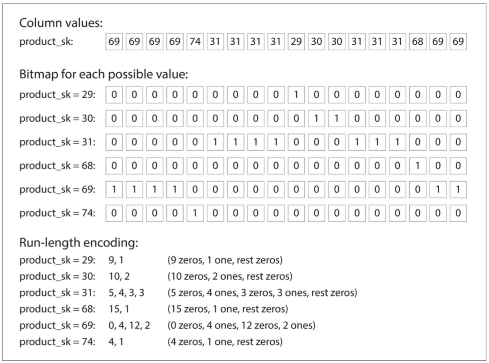

# 列存储

### 有序性

列存储，按列分成多个文件存储，但是原来行的顺序保留，比如要查原来第12行数据，那就要到每个列文件中取第12个值，最后能拼出原来行的数据

### 列压缩

前因：列的行数 >> 列出现的不同值（比如城市、产品id，数量有限）

方案：**位图索引**，将列的不同值，转为不同位图，总数是 n

- 当 n 较小，当该行具有该值时，记1，否则记0（即下图的 Bitmap for each possible value）
- 当 n 较大，即大部分行是0时（稀疏），额外做**游程编码**处理（即下图的Run-length encoding）

