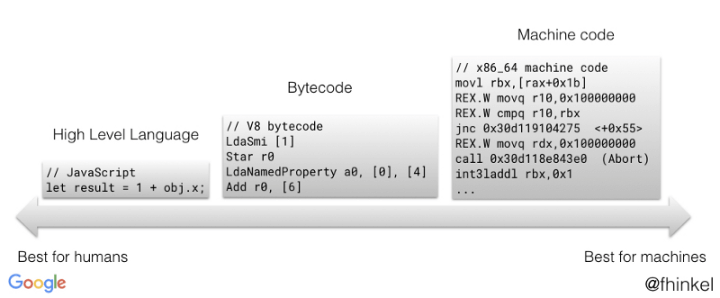

# v8

## 参考
- https://mp.weixin.qq.com/s/pv_4YRo6KjLiVxLViZTr2Q
- https://mp.weixin.qq.com/s/hARJrq_baizVkW5SPUl81Q
- [v8作者blog](https://mathiasbynens.be/)
- [v8优化骚套路](https://github.com/petkaantonov/bluebird/wiki/Optimization-killers)
- [对象模式](https://zhuanlan.zhihu.com/p/25069272)
- [v8全文档](https://v8.js.cn/docs/)

## 目录
<details>
<summary>展开更多</summary>

* [`并发标记`](#并发标记(mark-and-sweep))
* [`新v8架构的优化`](#新v8架构的优化)
* [`字节码和机器码`](#字节码和机器码)
* [`部分原生方法解析`](#部分原生方法解析)
* [`v8调试方式`](#v8调试方式-node)
* [`v8本地安装`](#v8本地安装)
* [`js引擎`](#js引擎)

</details>

## 并发标记(mark-and-sweep)
- 三色标记
  - 白色：收集器还未发现该对象
  - 灰色：收集器发现，并已推到标记工作表
  - 黑色：对象从标记工作表弹出，并已访问其全部字段
  - 当没有灰色对象时，标记结束。所有剩余的白色对象都可以安全地被回收。

---

## 新v8架构的优化
- Ignition 译码器
  - 较小的性能抖动
  - 提高启动速度
  - 改进基线性能
- 减少内存使用
- 支持新的语言特性

---

## 字节码和机器码
- [字节码](https://zhuanlan.zhihu.com/p/28590489)
- 

---

## 部分原生方法解析

### forEach
- 每次循环会做in判断导致比for-loop慢

---

## v8调试方式-node
- --print-bytecode // 打印字节码
- --trace-gc // 查看内存
- --trace_gc_verbose // 查看内存明细
- --allow-natives-syntax // 允许使用V8 引擎内部调试函数

---

## v8本地安装
* [Getting the Code](https://chromium.googlesource.com/v8/v8.git)
* [GET DEPOT TOOLS](http://www.chromium.org/developers/how-tos/install-depot-tools)
```js
// clone depot_tools
git clone https://chromium.googlesource.com/chromium/tools/depot_tools.git

// set path
export PATH=$PATH:/path/to/depot_tools
// restart terminal

// use `fetch` in depot_tools to get v8 source
fetch v8

// stay up to date
git pull origin
gclient sync

// get gn library
gclient runhooks

// add `gm` to alias
alias gm=/path/to/v8/tools/dev/gm.py

// build V8 for known configurations
gm x64.release

// run specific tests
gm x64.debug mjsunit/string-split

// build & run all test
gm x64.release.check

// run benchmarks
gm x64.debug benchmarks
```

---

## js引擎

### 主流JS引擎
- V8（Chrome和NodeJS)
- SpiderMonkey（FireFox）
- Chakra（IE和Eage）
- JavaScriptCore（Safari/ReactNative）

### 执行流程
[执行流程](./js引擎执行流程.png)

1. 解析器解析成ast
2. 解释器解析成字节码（效率高，执行慢）
3. 编译器将频繁调用的字节码编译替换成机器码（效率低，执行快）
4. 如果机器码推测是错误的，会执行“去优化”，还原成字节码

### 对象和数组
这块可以参考[shape&InlineCaches](../js&browser/Shapes&InlineCaches.md)

