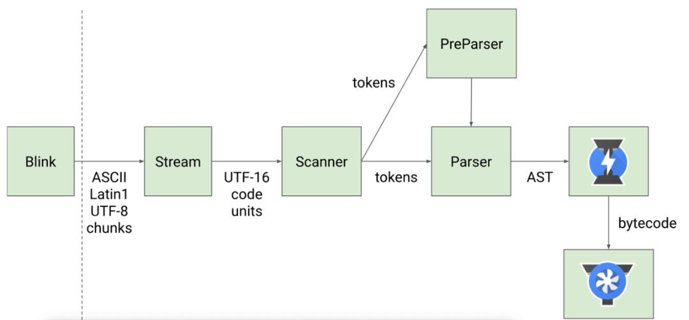

# v8

> 本质是一个虚拟机，将代码解释为二进制指令

## 参考
- https://mp.weixin.qq.com/s/pv_4YRo6KjLiVxLViZTr2Q
- https://mp.weixin.qq.com/s/hARJrq_baizVkW5SPUl81Q
- [v8作者blog](https://mathiasbynens.be/)
- [v8优化骚套路](https://github.com/petkaantonov/bluebird/wiki/Optimization-killers)
- [对象模式](https://zhuanlan.zhihu.com/p/25069272)
- [v8全文档](https://v8.js.cn/docs/)
- [chromium下载地址](https://commondatastorage.googleapis.com/chromium-browser-snapshots/index.html)
- [深入了解v8](https://segmentfault.com/a/1190000037435824)

## 目录
<details>
<summary>展开更多</summary>

* [`并发标记`](#并发标记(mark-and-sweep))
* [`新v8架构的优化`](#新v8架构的优化)
* [`字节码和机器码`](#字节码和机器码)
* [`部分原生方法解析`](#部分原生方法解析)
* [`v8调试方式`](#v8调试方式-node)
* [`v8本地安装`](#v8本地安装)
* [`js引擎`](#js引擎)
* [`d8`](#d8)
* [`代码缓存`](#代码缓存)
* [`v8内部结构`](v8内部结构)
* [`闭包的影响`](闭包的影响)
* [`快属性和慢属性`](快属性和慢属性)

</details>

## 并发标记(mark-and-sweep)
- 三色标记
  - 白色：收集器还未发现该对象
  - 灰色：收集器发现，并已推到标记工作表
  - 黑色：对象从标记工作表弹出，并已访问其全部字段
  - 当没有灰色对象时，标记结束。所有剩余的白色对象都可以安全地被回收。

---

## 新v8架构的优化

### v8历史
在 V8 引擎的 5.9 版本之前，有两个编译器：
- full-codegen  —— 一个简单快速的编译器，可以生成简单但是相对比较慢的机器码。
- Crankshaft —— 一个更加复杂的（即时）优化编译器，可以产生高度优化的代码。

### 优化点
- Ignition 译码器
  - 较小的性能抖动
  - 提高启动速度
  - 改进基线性能
- 减少内存使用
- 支持新的语言特性

---

## 字节码和机器码
- [字节码](https://zhuanlan.zhihu.com/p/28590489)
- 

### 常识
- 顺序：js -> 字节码 -> 机器码
- js编译后的字节码，会占用15%的v8堆内存

---

## 部分原生方法解析

### forEach
- 每次循环会做in判断导致比for-loop慢

---

## v8调试方式-node
- --print-bytecode // 打印字节码
- --trace-gc // 查看内存
- --trace_gc_verbose // 查看内存明细
- --allow-natives-syntax // 允许使用V8 引擎内部调试函数

---

## v8本地安装
* [Getting the Code](https://chromium.googlesource.com/v8/v8.git)
* [GET DEPOT TOOLS](http://www.chromium.org/developers/how-tos/install-depot-tools)
```js
// clone depot_tools
git clone https://chromium.googlesource.com/chromium/tools/depot_tools.git

// set path
export PATH=$PATH:/path/to/depot_tools
// restart terminal

// use `fetch` in depot_tools to get v8 source
fetch v8

// stay up to date
git pull origin
gclient sync

// get gn library
gclient runhooks

// add `gm` to alias
alias gm=/path/to/v8/tools/dev/gm.py

// build V8 for known configurations
gm x64.release

// run specific tests
gm x64.debug mjsunit/string-split

// build & run all test
gm x64.release.check

// run benchmarks
gm x64.debug benchmarks
```

---

## js引擎

### 主流JS引擎
- V8（Chrome和NodeJS)
- SpiderMonkey（FireFox）
- Chakra（IE和Eage）
- JavaScriptCore（Safari/ReactNative）

### 执行流程
[执行流程](./js引擎执行流程.png)

1. 解析器解析成ast
2. 解释器解析成字节码（效率高，执行慢）
3. 编译器将频繁调用的字节码编译替换成机器码（效率低，执行快）
4. 如果机器码推测是错误的，会执行“去优化”，还原成字节码

### 对象和数组
这块可以参考[shape&InlineCaches](../js&browser/Shapes&InlineCaches.md)

---

## 代码缓存

**V8 编译后的代码 Chrome 有两级缓存**

1. Isolate缓存
  - 尽可能使用已存在的数据（命中率80%）
  - 编译后，以源码为key存在hashtable（v8堆）中
  - 编译其他脚本时检测hashtable，是否存在可复用
2. 完整序列化的硬盘缓存

### 有效措施
- 不改资源url？
- 明确代码执行行为路径（一些random操作对缓存查找路径会有影响）
- 不变&常变代码分离（不变代码长期缓存，也能用于其他tab页面）
- IIFE 启发式
  ```js
  // 编译器扫到function 关键字之前的 (就会做编译
  // 不过除非必要，否则不推荐用
  const bar = (function() {
    // Eagerly compiled
  });
  ```
- 合并小文件
  
  * 1kb以下文件不会被缓存

---

## d8
> debug for v8


### 如何运行
下载一个[编译好的d8](https://storage.googleapis.com/chromium-v8/official/canary/v8-mac64-dbg-8.4.109.zip)

#### 命令行
1. 解压，sudo ./d8
2. 进入命令模式，直接可以输入js

#### 文件

```sh
./d8 ./test.js
```


---

## v8内部结构



Parser

> js转ast

ignition

> 即解释器，将ast转二进制码（bytecode）并执行，同时收集TurboFan优化编译所需信息。
>
> 通常有两种类型解释器： 
>
> 1. 基于寄存器（现在的v8），优势：
>    1. 更快（相较栈，可以用更少的指令，或者说更少的内存访问完成操作；内存访问是执行速度的一个瓶颈）
> 2. 基于栈（java、.Net、早期v8），优势：
>    1. 实现简单
>    2. 节省资源
>    3. 可移植性

TurboFan

> 即编译器，将二进制码（bytecode）转为汇编

Orinoco

> 即垃圾回收器

---

## 闭包的影响

### 一等公民

> 在编程语言中，一等公民可以作为函数参数，可以作为函数返回值，也可以赋值给变量，
>
> 所以在javascript，**函数**是一等公民

### 静态作用域和动态作用域

静态作用域：编译时即可确定上下引用关系

动态作用域：执行时确认引用关系

### 惰性解析

> 解析器在解析过程中，会跳过函数内部代码，而只生产顶层代码的ast和字节码，原因在于：
>
> 1. 减少用户等待时间
> 2. 降低内存占用
>
> **闭包的问题就是游离态的变量，不会随执行上下文被销毁**

### 预解析器

> v8引入了预解析器，即遇到一个函数，不会跳过，而是做一次快速检查：
>
> 1. 函数是否有语法错误，有则直接抛错
> 2. 函数是否引用了外部变量，有则会将栈中的变量复制到堆中，下次执行函数时，直接使用堆中的引用，以此解决闭包问题（内存泄漏）

---

## 快属性和慢属性

```js
// 举例：
function Foo() {
  this[200] = 'test-200';
  this[1] = 'test-1';
  this[100] = 'test-100';
  this['B'] = 'bar-B'
  this[50] = 'test-50';
  this[9] = 'test-9';
  this[8] = 'test-8';
  this[3] = 'test-3';
  this[5] = 'test-5';
  this['D'] = 'bar-D';
  this['C'] = 'bar-C';
}
var bar = new Foo();
for (key in bar) {
  console.log(`index:${key} value:${bar[key]}`);
}

// 请问key输出顺序是什么？
// 在ECMAScript 规范中定义了数字属性应该按照索引值大小升序排列，字符串属性根据创建时的顺序升序排列。
```


v8默认会使用线性结构存储，即**排序属性**和**常规属性**：

- 数字属性称为elements，排序属性

- 字符串称为properties，常规属性，其中部分（默认**10个**）常规属性会直接存储到对象本身，称为**对象内属性**

**当对象中属性过多，或者存在反复添加/删除属性**的操作，v8会将线性存储降为非线性的字典存储模式（降低查找速度，提升属性修改速度）

