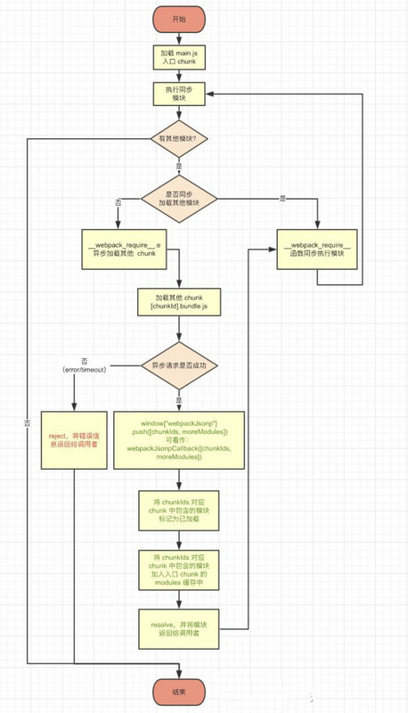
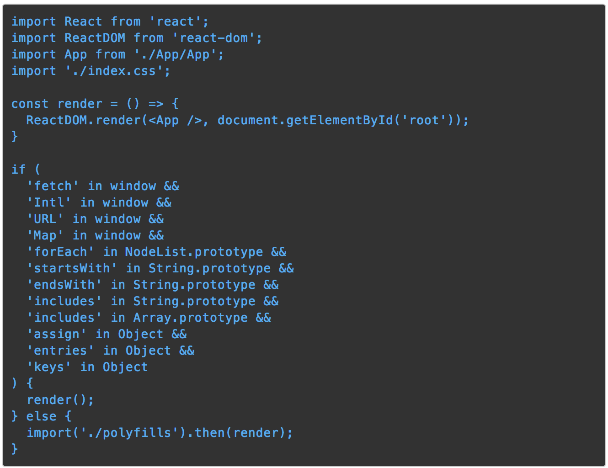

# webpack

## 参考
- [tapable插件机制解析](https://segmentfault.com/a/1190000017420937)
- [webpack4js拆包](https://mp.weixin.qq.com/s/a946nG0oNYnDBMMwgtDBpA)
- [webpack4配置指南](https://mp.weixin.qq.com/s/cX7yuneDxDk8_NnMy3Bc8Q)
- [webpack4配置指南2](https://mp.weixin.qq.com/s/si4yq-M_JS0DqedAhTlKng)
- [webpack官方plugin文档](https://webpack.js.org/api/compilation-hooks#shouldgeneratechunkassets)
- [webpack4构建提速](https://juejin.im/post/5c9075305188252d5c743520#heading-5)

## 目录
<details>
<summary>展开更多</summary>

* [`差异化`](#差异化)
* [`常用配置`](#配置)
* [`webpack加载流程`](#webpack加载流程)
* [`webpack-3.8.1`](#webpack-3.8.1)
* [`webpack4`](#webpack4)
* [`plugin`](#plugin)
* [`中间缓存`](#中间缓存)
* [`bundle`](#bundle)
* [`scope hoisting`](#scopeHoisting)
* [`code split`](#codesplit)
* [`tree shaking`](#treeshaking)
* [`tapable`](#tapable)
* [`plugin`](#plugin)
* [`loader`](#loader)
* [`热更新`](#热更新)
* [`其他`](#其他)

</details>

## 差异化

### webpack与grunt、gulp的不同

**grunt、gulp**

> grunt、gulp是基于任务运行工具，打造工作流
> 可以插入各种个性化工具，执行自定义任务

**webpack**

> webpack基于模块打包的工具

### webpack与rollup、parcel的不同

**webpack**

大型项目构建

**rollup**

基础库、插件，集成打包


**parcel**

简单项目，生态较差

---

## 配置

### output
```js
{
  output:{
   // name是你配置的entry中key名称，或者优化后chunk的名称
   // hash是表示bundle文件名添加文件内容hash值，以便于实现浏览器持久化缓存支持
   filename: '[name].[hash].js',
   // 在script标签上添加crossOrigin,以便于支持跨域脚本的错误堆栈捕获
   crossOriginLoading:'anonymous',
   //静态资源路径，指的是输出到html中的资源路径前缀
   publicPath:'https://7.ur.cn/fudao/pc/',
   path: './dist/',//文件输出路径
  }
}
```

### module
配置rules
```js
module: {
  // 这些库都是不依赖其它库的库 不需要解析他们可以加快编译速度
  // 优化点1：过滤不需要做任何处理的库
  noParse: /node_modules\/(moment|chart\.js)/,
  rules: [
    {
      test: /\.jsx?$/,
      use: resolve('babel-loader'),
      // 优化点2：缩小babel处理范围
      include: [
        path.resolve(projectDir, 'src'),
        path.resolve(projectDir, 'node_modules/@test'),
      ].filter(Boolean),
      // 优化点3：忽略哪些压缩的文件
      exclude: [/(.|_)min\.js$/],
    }
  ],
}
```

### optimization

#### splitChunks

**拆分标准**

- 基础框架（react、redux）
- 基础工具（lodash、utils）
- 基础ui（antd）

**每次打包的id一直变怎么破？**

> HashedModuleIdsPlugin

```js
{
  // ...
  plugins: [
    // ...
    new webpack.HashedModuleIdsPlugin(),
  ],
  // ...
}
```

**示例用法**

```js
splitChunks: {
  chunks: 'all',
  minSize: 10000, // 提高缓存利用率，这需要在http2/spdy
  maxSize: 0,//没有限制
  minChunks: 3,// 共享最少的chunk数，使用次数超过这个值才会被提取
  maxAsyncRequests: 5,//最多的异步chunk数
  maxInitialRequests: 5,// 最多的同步chunks数
  automaticNameDelimiter: '~',// 多页面共用chunk命名分隔符
  name: true,
  cacheGroups: {// 声明的公共chunk
    vendor: {
      // 过滤需要打入的模块
      test: module => {
        if (module.resource) {
          const include = [/[\\/]node_modules[\\/]/].every(reg => {
            return reg.test(module.resource);
          });
          const exclude = [/[\\/]node_modules[\\/](react|redux|antd)/].some(reg => {
            return reg.test(module.resource);
          });
          return include && !exclude;
        }
        return false;
      },
      name: 'vendor',
      priority: 50,// 确定模块打入的优先级
      reuseExistingChunk: true,// 使用复用已经存在的模块
    },
    react: {
      test({ resource }) {
        return /[\\/]node_modules[\\/](react|redux)/.test(resource);
      },
      name: 'react',
      priority: 20,
      reuseExistingChunk: true,
    },
    antd: {
      test: /[\\/]node_modules[\\/]antd/,
      name: 'antd',
      priority: 15,
      reuseExistingChunk: true,
    },
  },
},
```

#### minimizer

### resolve
```js
{
  // ...
  resolve: {
    // 现在可以写require('file')，代替require('file.jsx')或 require('file.es6')
    extensions: ['.*', '.js', '.jsx', '.es6'],
    // modules加速绝对路径查找效率
    modules: [
        path.resolve(__dirname, 'src'), 
        path.resolve(__dirname,'node_modules'),
    ],
    // alias路径替换
    alias: {
      'react': 'anujs',
      'react-dom': 'anujs',
      '@': path.resolve(__dirname, './src'),
    },
  },
  // ...
}
```

### hash

> hash形式共分为三种

#### 普通hash
- 跟整个项目的构建相关，构建生成的文件hash值都是一样的
- 只要项目里有文件更改，整个项目构建的hash值都会更改

```js
const path = require('path');

module.exports = {
  entry:{
    main: './index.js',
    vender:['./a.js','./b.js']
  },
  output:{
    path:path.join(__dirname, '/dist/js'),
    filename: 'bundle.[name].[hash].js',
  },
}
```

输出
```text
=> bundle.main.abc.js
=> bundle.vender.abc.js
```

#### chunkhash

- 根据不同的入口文件(Entry)进行依赖文件解析、构建对应的chunk，生成对应的hash值
- 利用chunkhash，公共库可以选择单独打包，只要文件内容不变，chunkhash不变

```js
const extractTextPlugin = require('extract-text-webpack-plugin');
const path = require('path');

module.exports = {
  // entry同上
  // ...
  output:{
    path:path.join(__dirname, '/dist/js'),
    filename: 'bundle.[name].[chunkhash].js',
  },
  plugins:[
    new extractTextPlugin('../css/bundle.[name].[chunkhash].css'),
  ],
}
```

输出
```text
=> bundle.main.aaaaaaaaa.js
=> bundle.vender.bbbbbbbbbb.js
=> bundle.main.aaaaaaaaa.css
```

#### contenthash

- 由文件内容产生的hash值，内容不同产生的contenthash值也不一样

上例中，由于index.js引用了index.css，所以index.js有变动，index.css即使没有变动,
打包出的文件，hash值也会变化，这时候就需要用到contenthash

```js
const extractTextPlugin = require('extract-text-webpack-plugin');
const path = require('path');
  
module.exports = {
  // entry同上
  // ...
  output:{
    path:path.join(__dirname, '/dist/js'),
    filename: 'bundle.[name].[chunkhash].js',
  },
  plugins:[
    // 设置css的hashid跟其content走
    new extractTextPlugin('../css/bundle.[name].[contenthash].css'),
  ]
}
```

> hash 生成规则分为两种

#### debug
```js
// 字母、数字转16进制
const hashid = this.input.replace(/[^a-z0-9]+/gi, m =>
  Buffer.from(m).toString("hex")
);
```

#### crypto
```js
// algorithm分'sha256','sha512'
const hashid = require("crypto").createHash(algorithm);
const data = '...';
hashid.update(data);
return hashid.digest('hex');
```

字符编码可[参考](../node/README.md#字符编码encoding)


### mpa配置

```
├── README.md
├── app // 开发源代码目录
│   ├── assets // 资源目录
│   │   ├── images
│   │   └── styles
│   │       ├── common.less
│   └── pages // 多页面入口目录
│       ├── entry1
│       │   ├── index.html
│       │   ├── index.js
│       │   ├── index.less
│       └── entry2
│           ├── index.html
│           ├── index.js
│           └── index.less
├── configs // webpack配置文件目录
│   ├── env.js
│   ├── module.js
│   ├── optimization.js
│   ├── plugins.js
│   ├── webpack.config.babel.js
│   └── webpackDevServer.config.babel.js
├── dist // 打包输出目录
├── package.json
├── scripts // 启动和打包脚本
│   ├── build.js
│   ├── devServer.js
│   └── start.js
├── yarn-error.log
├── yarn.lock
```

---

## webpack-3.8.1解析

- 主体
  - 支持webpack([conf1, conf2], callback)
  - webpackOptionsValidationErrors
    - 使用ajv校验options的json格式
  - Compiler
    - 编译器，生命周期会触发n多hooks...，插件要在不同hooks中做些callback
  - WebpackOptionsDefaulter
    - 填充默认配置项
  - NodeEnvironmentPlugin
    - 绑定文件内容变更的监控（输入、输出、监听、缓存）
  - compiler.apply.apply(compiler, options.plugins)
    - 执行plugins
  - WebpackOptionsApply
    - 定义打包出来的模板
      - JsonpTemplatePlugin
        - this-compilation
      - FunctionModulePlugin
        - compilation
      - NodeSourcePlugin
        - compilation
        - after-resolvers
      - LoaderTargetPlugin
        - compilation
        - normal-module-loader
      - EntryOptionPlugin
        - entry-option
      - ...

---

## plugin

> apply
> 插件初始化操作
>
> compiler
> webpack初始化，返回的就是一个compiler对象
> 内部包含hooks、compilation和finalcallback回调
>
> compilation
> 针对四种template的具体处理
> 内部包含hooks、和template处理


### 调试
```js
// webpack.config.js放根目录，或者--config=指定路径
ndb ./node_modules/webpack/bin/webpack.js --inline --progress
```

### plugin开发

#### hook注入
```js
class CopyrightWebpackPlugin {
  // 调用plugin时，默认先执行apply
  apply(compiler) {
    const hooks = compiler.hooks;

    // webpack4+的写法
    if (hooks) {
      // 在`compile`hook，同步注入回调
      hooks.compile.tap('CopyrightWebpackPlugin', (compilation, cb) => {
        this.handleInit();
      });
    // webpack1-3的写法
    } else {
      compiler.plugin('compile', () => {
        this.handleInit();
      });
    }
  },
  handleInit() {
    // ...
  },
  
}

module.exports = CopyrightWebpackPlugin;
```

### template
> 四种template
> 每个template处理都包含hooks和render处理

- mainTemplate
  * 处理入口文件的module
- chunkTemplate
  * 处理非首屏、需要异步加载的module
- moduleTemplate
  * 处理所有模块的生成
- HotUpdateChunkTemplate
  * 热更新模块的处理

### tapable
不同种类的hook

### plugin学习

#### WarnNoModeSetPlugin

**作用**

当mode字段未设值时有提示

```js
if (typeof options.mode !== "string") {
  const WarnNoModeSetPlugin = require("./WarnNoModeSetPlugin");
  new WarnNoModeSetPlugin().apply(compiler);
}
```

**调用位置**

/webpack/lib/WebpackOptionsApply.js

**hook**

```js
/*
compiler.hooks.thisCompilation -> tap('WarnNoModeSetPlugin', () => {
  compilation.warnings.push(new NoModeWarning)
})
*/
```

#### SetVarMainTemplatePlugin
**作用**

**调用位置**

/webpack/lib/LibraryTemplatePlugin.js

**hook**

```js
/*
chunkTemplate.hooks.renderWithEntry -> tap('SetVarMainTemplatePlugin', onRenderWithEntry)

mainTemplate.hooks.renderWithEntry -> tap('SetVarMainTemplatePlugin', onRenderWithEntry)

mainTemplate.hooks.globalHashPaths -> tap('SetVarMainTemplatePlugin', paths => {
  paths.push(this.varExpression)
})

mainTemplate.hooks.hash -> tap("SetVarMainTemplatePlugin", hash => {
  hash.update(/* ... */)
})
 */
```

#### xxx
**作用**
**调用位置**
**hook**

### loader开发
// TODO

### 热更新操作

#### 组件、css
- webpack.HotModuleReplacementPlugin
- entry插入**require.resolve('../utils/webpackHotDevClient')**
- webpack-dev-server启动参数加上**hot: true**
- 热更新的js加上
  ```js
  if (process.env.NODE_ENV === 'development' && module.hot) {
    module.hot.accept();
  }
  ```

#### ssr
webpack.watch + nodemon

#### style
`sourceMap: true`: 将sourcemap内联到style中，方便快速调试，但是会导致页面闪烁（FOUC）
`singleton: true`: 复用同一个插入的style标签，能解决FOUC，但sourceMap就失效了（找不到源文件路径，而是合并后的路径）

---

## 中间缓存

### babel-loader
```js
test: /\.jsx?$/,
use: [
  {
    loader: resolve('babel-loader'),
    options: {
      babelrc: false,
      // cacheDirectory 缓存babel编译结果加快重新编译速度
      cacheDirectory: path.resolve(options.cache, 'babel-loader'),
      presets: [[require('babel-preset-imt'), { isSSR }]],
    },
  },
],
```

### eslint-loader
```js
test: /\.(js|mjs|jsx)$/,
enforce: 'pre',
use: [
    {
      options: {
        // cache选项指定缓存路径
        cache: path.resolve(options.cache, 'eslint-loader'),
      },
      loader: require.resolve('eslint-loader'),
    },
],
```

### css/scss
cache-loader也可用于其他缓存
```js
{
  loader: resolve('cache-loader'),
  options: { cacheDirectory: path.join(cache, 'cache-loader-css') },
},
{
  loader: resolve('css-loader'),
  options: {
    importLoaders: 2,
    sourceMap,
  },
},
```

### js
```js
{
    // 设置缓存目录
    cache: path.resolve(cache, 'terser-webpack-plugin'),
    parallel: true,// 开启多进程压缩
    sourceMap,
    terserOptions: {
      compress: {
        // 删除所有的 `console` 语句
        drop_console: true,
      },
    },
}
```

---

## webpack加载流程

[参考](https://segmentfault.com/a/1190000019117897?utm_medium=hao.caibaojian.com&utm_source=hao.caibaojian.com&share_user=1030000000178452)

### webpack异步加载

- import(/* ... */).then(() => {/* ... */});
- ```js
  // 1. 创建script标签，src根据chunkId从installedChunks取
  // 2. 挂到head
  // 3. 12秒超时
  // 4. script加载结束，更新installedChunks标记
  __webpack_require__.e = function requireEnsure(chunkId) {
    // ...
    new Promise(() => {
      const script = document.createElement('script');
      script.src = installedChunks[chunkId];
      script.onLoad = () => {
        // ...
        installedChunks[chunkId] = void 0;
        // ...
      };
      document.head.appendChild(script);
      setTimeout(function(){
        onScriptComplete({ type: 'timeout', target: script });
      }, 120000);
    });
    // ...
  };
  ```
- ```js
  __webpack_require__.e(0).then(/* ... */);
  ```



---

## webpack4
[参考](https://juejin.im/entry/5b63eb8bf265da0f98317441)
[webpack4的24个实例](https://juejin.im/post/5cae0f616fb9a068a93f0613?utm_medium=hao.caibaojian.com&utm_source=hao.caibaojian.com#heading-1)

### 流程图


### 相比webpack3
* 4多了mode字段，用于切换开发/生成环境
* 4支持了读取npm依赖的module字段，es6module
* 2、3的摇树会判断，如果方法有入参，或操纵了window，则不会摇掉，因为这些函数有副作用
  4的摇树默认会摇掉，如果sideEffect置为false，则不摇

### 流程简述
- 初始化参数
- 开始编译
  * 根据初始化参数，加载所需插件
- 确定入口
  * 解析entry，做不同文件打包
- 编译模块
  * 从入口文件触发，根据配置的loaders，从后往前执行模块编译，递归此步骤直至所有模块都被编译
- 完成编译
  * 根据上一步编译结果，明确各模块之间的依赖关系
- 输出资源
  * 将文件组装成一个个chunk，再把chunk转换成文件输出
  * 修改文件前的最后机会
- 输出完成
  * fs.writeFile

### sideEffects
import {a} from xx -> import {a} from xx/a

### tree shaking
 [参考](https://zhuanlan.zhihu.com/p/32831172)

上面提到的由于副作用，所以不会摇掉的，可以参考下面例子，
V6Engine方法没有用到，但是修改了V8Engine的原型，如果摇掉会有问题

 ```js
 var V8Engine = (function () {
  function V8Engine () {}
  V8Engine.prototype.toString = function () { return 'V8' }
  return V8Engine
}())
var V6Engine = (function () {
  function V6Engine () {}
  V6Engine.prototype = V8Engine.prototype // <---- side effect
  V6Engine.prototype.toString = function () { return 'V6' }
  return V6Engine
}())
console.log(new V8Engine().toString())
 ```

### babel7
[参考](../babel/README.md)

### browserslist
[browserslist](https://github.com/browserslist/browserslist)

**用于在不同前端工具之间共享目标浏览器和 Node.js 版本的配置**

#### 使用方法
- 添加到 package.json
  ```json
  {
    "dependencies": {

    },
    "browserslist": [
      "> 1%",
      "last 2 version",
      "not ie <= 8"
    ]
  }
  ```
- 创建 .browserslist
  ```text
  # 所支持的浏览器版本
  > 1% # 全球使用情况统计选择的浏览器版本
  last 2 version # 每个浏览器的最后两个版本
  not ie <= 8 # 排除小于 ie8 以下的浏览器
  ```

### code splitting配置

**splitChunksPlugins**

```js
module.exports = {
  // ...
  optimization: {
    splitChunks: {
      chunks: 'all', // 分割所有代码，包括同步代码和异步代码
      // chunks: 'async'，// 默认，分割异步代码
    }
  },
};
```

 ---

## treeshaking
- [基本原理](https://juejin.im/post/5a4dc842518825698e7279a9)
- [拓展](https://diverse.space/2018/05/better-tree-shaking-with-scope-analysis)
- [escope](https://github.com/estools/escope)

### 为什么只针对es6module

**静态分析**

不执行代码，从字面量上对代码进行分析

**ES6 module 特点***

- 依赖关系是确定的
- 只能作为模块顶层的语句出现
- import 的模块名只能是字符串常量
- import binding 是 immutable的

### rollup、webpack、google Closure对比

**rollup**
- unused函数能消除，未触达的代码没消除
- 配合uglifyjs能消除未触达的代码
- 只处理函数和顶层的import/export变量，不能把没用到的类的方法消除掉

**webpack**
- unused函数未消除，未触达的代码没消除
- 配合uglifyjs能消除未触达的代码
- 只处理函数和顶层的import/export变量，不能把没用到的类的方法消除掉
  ```js
  function Menu() {
  }

  Menu.prototype.show = function() {
  }

  var a = 'Arr' + 'ay'
  var b
  if(a == 'Array') {
      b = Array
  } else {
      b = Menu
  }

  b.prototype.unique = function() {
      // 将 array 中的重复元素去除
  }

  export default Menu;
  ```

**google Closure**
- unused函数、未触达的代码都能消除
- 对业务代码有侵入性，比如需要加特定的标注

**结论**
google Closure Compiler效果最好，不过使用复杂，迁移成本太高

---

## scopeHoisting
[作用域提升](https://webpack.js.org/plugins/module-concatenation-plugin/#root)

### 示例

原打包输出内容
```js
// bundle.js
// 最前面的一段代码实现了模块的加载、执行和缓存的逻辑，这里直接略过
[
  /* 0 */
  function (module, exports, require) {
    var module_a = require(1)
    console.log(module_a['default'])
  },
  /* 1 */
  function (module, exports, require) {
    exports['default'] = 'module A'
  }
]
```

作用域提升后
```js
// bundle.js
[
  function (module, exports, require) {
    // CONCATENATED MODULE: ./module-a.js
    var module_a_defaultExport = 'module A'

    // CONCATENATED MODULE: ./index.js
    console.log(module_a_defaultExport)
  }
]
```

### 特点
- 声明的函数减少，作用域减少
- 文件体积减少

### 原理
将所有模块代码，以一定顺序声明在一个作用域里（会做变量名去重）

### 要求
- 必须以es2015模块语法方式
- 暂不支持commonjs【require可以动态加载，无法预测模块间依赖关系】
- webpack4的production模式会默认使用scope hoisting
- 查看使用无效的原因
  ```js
  module.exports = {
    //...
    stats: {
      // Examine all modules
      maxModules: Infinity,
      // Display bailout reasons
      optimizationBailout: true
    }
  };

  // 或
  webpack --display-optimization-bailout
  ```

---

## codesplit
// TODO

---

## bundle
[参考](https://zhuanlan.zhihu.com/p/25954788)

### 结论
- bundle时，会检查模块是否会被installed
- 如果installed，就直接export使用
- 否则会执行import（一次），缓存到installedModules，再export

### webpack打包做些什么
- 每个文件视为独立模块
- 分析模块间依赖关系，做一次性替换
- 给每个模块外层加一层包装函数，作为**模块初始化函数**
- 所有初始化函数合成数组，赋值给modules变量

### 模块初始化函数

**webpack4**

```js
(window["webpackJsonp"] = window["webpackJsonp"] || []).push(
  [["输出文件名"], {
    "a": (function (module, __webpack_exports__, __webpack_require__) {
      // ...
    }),
    "b": (function (module, __webpack_exports__, __webpack_require__) {
      // ...
    }),
    "c": (function (module, __webpack_exports__, __webpack_require__) {
      // ...
    }),
    // ...
  }]
);
```

**webpack2**

```js
(function (modules) {
  ...
})([
  (function (module, __webpack_exports__, __webpack_require__) {
    ...
  }),
  (function (module, __webpack_exports__, __webpack_require__) {
    ...
  }),
  (function (module, __webpack_exports__, __webpack_require__) {
    ...
  })
]);
```

### module和__webpack_exports__

#### module
- 元信息
- 模块内容、**模块id**等信息

#### __webpack_exports__
- require时读取的是这个对象

#### 关系
module.exports === __webpack_exports__

### 模块id
webpack4 - 4位随机字母【0-9、a-zA-Z、+-】
webpack2 - 数字（0开始）

### __webpack_require__
```js
function __webpack_require__(moduleId) {

  // 检查 installedModules 中是否存在对应的 module
  // 如果存在就返回 module.exports
  if (installedModules[moduleId])
    return installedModules[moduleId].exports;

  // 创建一个新的 module 对象，用于下面函数的调用
  var module = installedModules[moduleId] = {
    i: moduleId,
    l: false,
    exports: {}
  };

  // 从 modules 中找到对应的模块初始化函数并执行
  modules[moduleId].call(module.exports, module, module.exports, __webpack_require__);

  // 标识 module 已被加载过
  module.l = true;

  return module.exports;
}
```

### 组成

**modules**

数组（webpack2）或对象（webpack4），保存模块初始化函数

**installedModules**

缓存加载过的模块

**加载函数**

__webpack_require__

---

## tapable
[参考](https://juejin.im/post/5cb43b3e5188251b2b20b7ed?utm_medium=hao.caibaojian.com&utm_source=hao.caibaojian.com#heading-18)

### SyncHook
- 比较像订阅发布，同步
- 注册事件是tap
- 事件执行是call
- 就像jquery中的add、fire方法，只不过这里是tap、call
- ```js
  arr.forEach(handler)
  ```

### SyncBailHook
- 主要解决的问题是条件阻塞
- 有熔断机制，前一个监听返回值非undefined，则停止
- ```js
  arr.some(handler)
  ```

### SyncWaterfallHook
- 前一个任务的执行结果，传递给后一个
- 类似redux中的compose
- ```js
  arr.reduce((pre, next) => next(pre))
  ```

### SyncLoopHook
- 能够执行多次
- 返回undefined则停止执行，返回非undefined则继续执行当前任务
- ```js
  let index = 0;
  while (index < this.tasks.length) {
    if (this.tasks[index]() === undefined) {
      index++;
    }
  }
  ```

### AsyncParralleHook
- 异步并行
- 注册事件是tapAsync
- 事件执行是callAsync
- 类似Promise.all
- ```js
  const tasks = this.tasks.map(task=>task(...param));
  Promise.all(tasks);
  ```

### AsyncParallelBailHook
- 只要返回真，都会进catch
- 无论结果，所有监听都会执行
- 绑定方式
  * tap，同SyncBailHook效果
  * tapSync，则遇到return true最终的callback不会执行
  * promise，则遇到rejcet(true)，则直接进入catch
- ```js
  Promise.all(tasks.map((task) => {
    return new Promise((resolve, reject) => {
      task().then((data) => {
        resolve(data);
      }, (err) => {
        err ? reject(err) : resolve();
      });
    });
  }))
  ```

### AsyncSeriesHook
- 异步任务，串行处理
- ```js
  const [first, ...others] = tasks;
  others.reduce((pre,next)=>{
    return pre.then(()=>next(...param))
  }, first());
  ```

### AsyncSeriesBailHook
- 返回值不是undefined，阻塞之后的监听

### AsyncSeriesWaterfallHook
- 用法和SyncWaterFallHook的用法一致

---

## loader

- 单一转译原则
- this.async(): 生成callback函数，callback输出转译的内容
- this.cacheable(): 直接透传缓存文件

### less-loader
- 使用@functions做px<->rem转换
  * ```js
    // webpack.config.js
    // 设置javascriptEnabled
    // ...
    {
      test: /\.less/,
      exclude: /node_modules/,
      use: ['style-loader', 'css-loader', {
        loader: 'less-loader',
        options: {
          javascriptEnabled: true
        }
      }],
    },
    // ...
    ```
  * ```less
    .remMixin() {
      @functions: ~`(function() {
        var clientWidth = '375px';
        function convert(size) {
          return typeof size === 'string' ? 
            +size.replace('px', '') : size;
        }
        this.rem = function(size) {
          return convert(size) / convert(clientWidth) * 10 + 'rem';
        }
      })()`;
    }

    .remMixin();

    .bb {
      width: ~`rem("300px")`;
      height: ~`rem(150)`;
      background: blue;
    }
    ```

---

## 其他
- a chunk is a group of modules within the webpack process, a bundle is an emitted chunk or set of chunks.
- 使用 import()，需要dynamic-import插件 (https://babeljs.io/docs/en/babel-plugin-syntax-dynamic-import/)
- 
- [据说比babel快几十倍的compiler](https://github.com/swc-project/swc)
- [prepack-顾名思义代码预编译](https://prepack.io/)

---

## 热更新
1. 利用 webpack-dev-server（express），建立 HMR server
2. 页面 dev-server/client 和 HMR server 建立 websocket 通信
3. webpack 编译生成的新代码，通过 HMR server 发送给页面
4. 页面根据 socket 获取的 chunk 头进行比较，获知需要更新的模块
5. 模块根据 module.hot.accpet，判断能否更新，若无法更新，强刷页面


